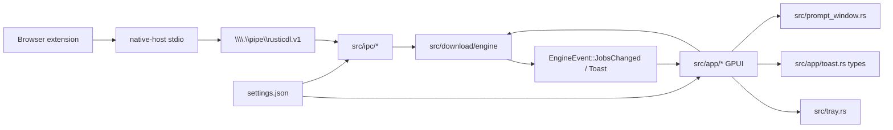
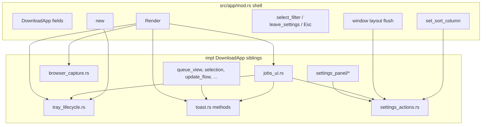
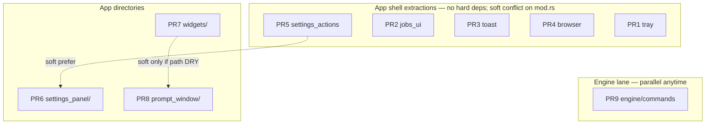

# RusticDL Modularization / Maintainability Refactor Plan

| Field | Value |
| --- | --- |
| **Document title** | RusticDL Modularization / Maintainability Refactor Plan |
| **Author** | design-doc-writer (for JustNak / RusticDL) |
| **Date** | 2026-08-12 |
| **Status** | Ready for implementation (rev 3 — design review approved) |
| **Baseline version** | 0.2.7 (`Cargo.toml`) |
| **Workspace** | `C:\Users\ZeusVeilmon\Desktop\Project\Program\RustyDownloadManager` |
| **Type** | Pure maintainability refactor (behavior-preserving) |

---

## Overview

RusticDL is a local-first Windows HTTP(S) download manager built with GPUI + Rust. The download engine (`src/download/*`), IPC stack (`src/ipc/*`), and many UI surfaces are already modular. The remaining maintainability debt concentrates in a few hotspots — especially `src/app/mod.rs` (~1754 nonempty LOC), which still owns tray lifecycle, jobs/OS-notify wiring, toasts, settings draft setters, browser-capture pollers, appearance drafts, construction, and render.

This document is an **implementation-ready modularization plan**. It splits large files into focused sibling modules using the **existing codebase pattern** (`impl DownloadApp` in sibling files under `src/app/`, as in `selection.rs`, `queue_view.rs`, `update_flow.rs`). Each PR is independently reviewable, mergeable, and **behavior-preserving** (move/re-export only; no intentional UX or engine semantic changes). The user will run `/execute-plan` against this document.

**Rev 2 focus:** per-PR visibility matrix (`pub(crate)` / `pub(super)`), correct bin-only test commands, `settings_panel/` naming to avoid collision with `crate::settings`, hard vs soft PR dependencies, and executable per-PR verification checklists.

**Rev 3 focus:** include `force_quit_app` in tray PR 1 + matrix; correct `new` 80ms timer callers for poll helpers; require `handle_tray_event` / `on_window_activated` `pub(crate)`; PR 8 `BrowserPromptWindow` `pub(super)` phase methods.

---

## Background & Motivation

### Current architecture (as implemented, 0.2.7)



| Area | Key files | State (verified 2026-08-12) |
| --- | --- | --- |
| Root view / god object | `src/app/mod.rs` (~1754 nonempty / ~1887 total LOC) | `DownloadApp` (~53 fields); tray, jobs, OS notify, toasts, settings drafts, appearance, browser pollers, `new` (~350 LOC), `Render` |
| UI already split | `queue_view.rs`, `selection.rs`, `update_flow.rs`, `add_dialog.rs`, `confirm_dialogs.rs`, `sidebar.rs`, `title_bar.rs`, `status_bar.rs`, `detail.rs`, `job_row.rs`, `about_dialog.rs`, `shortcuts.rs` | Pattern: `impl DownloadApp { … }` + `use super::DownloadApp`; callees already `pub(crate)` / `pub(super)` |
| Toast types only | `src/app/toast.rs` (types only, ~36 total / ~30 nonempty LOC) | Types/constants; methods still live in `mod.rs` (~863–1016) |
| Settings UI | `src/app/settings_panel.rs` (~1141 nonempty LOC) | Shell + four category renderers in one file |
| Settings nav enum | `src/app/settings_category.rs` | `SettingsCategory::{General,System,Browser,Appearance}` |
| Widget junk drawer | `src/app/widgets.rs` (~795 nonempty LOC) | Settings + queue + nav + chrome helpers + tests |
| Browser capture HUD | `src/prompt_window.rs` (~1067 nonempty LOC) | Confirm + Progress + Complete + open helpers |
| Engine commands | `src/download/engine/commands.rs` (~784 nonempty / ~861 total LOC + tests) | Giant `match` on `EngineCommand` |
| Engine façade | `src/download/engine/mod.rs` (~462 LOC) | Types, spawn loop, helpers; `mod commands` |
| IPC (good) | `src/ipc/{mod,bridge,handlers,protocol,server}.rs` | Façade re-exports; leave alone |
| Download domain (good) | `src/download/{duplicates,handoff,urls,http,filesystem,job}.rs` | Leave alone |
| Cohesive leave-alone | `notifications.rs` (~769), `tray.rs` (~700), `http.rs` (~693), `settings.rs` (~624) | Do not split for line count |

**LOC measurement convention:** Hotspot sizes in this document are **nonempty line counts** (blank lines excluded) unless marked “total.” G1 uses nonempty LOC as a soft guide; physical/total line counts will be higher due to blanks and comments.

### Existing sibling-module pattern (preserve this)

Established in files such as `src/app/selection.rs` and `src/app/update_flow.rs`:

```rust
// src/app/selection.rs
use super::DownloadApp;
use crate::download::Job;

impl DownloadApp {
    pub(crate) fn primary_selected_id(&self) -> Option<&str> { /* … */ }
    // …
}
```

Parent `src/app/mod.rs` declares:

```rust
mod selection;
// fields + new + shell methods + Render stay here
```

No new traits, no plugin system, no GPUI child-`Entity` split for panels. Visibility is typically `pub(crate)` / `pub(super)` as needed for a binary crate — **required** when methods leave the parent module (see [Visibility rule](#visibility-rule-mandatory-for-every-extraction)).

### Pain points

1. **`mod.rs` is a god object** — ~53 fields and methods spanning tray, jobs/persist/OS notify, toasts, settings drafts, browser capture, appearance, filter navigation, construction, and render. Reviewers cannot reason about one concern without scrolling hundreds of lines.
2. **`settings_panel.rs` mixes four category UIs** — General (~134–274), System (~275–491), Browser (~492–727), Appearance (~728–end) plus shell/footer (~33–132). Category work forces loading the whole file.
3. **`widgets.rs` is a junk drawer** — vignette/chrome, progress, path helpers, settings form widgets, queue cells, nav items. Call sites already import specific symbols (`job_row`, `sidebar`, `settings_panel`, `add_dialog`).
4. **`prompt_window.rs` is multi-phase** — one file owns Confirm/Progress/Complete structs, render, open helpers, and duplicated path/progress helpers.
5. **`engine/commands.rs` is a flat match + tests** — Add alone is ~170 lines; job control, bulk, settings, and unit tests share one file.
6. **Small DRY debt** — `widgets::shorten_path_display` ≈ `prompt_window::shorten_path`; `styled_progress` vs `capture_progress_bar`; near-identical extension draft setters in `mod.rs`.

### Why now

`docs/plans/near-term-v0.2-foundation.md` treats modularization as **enabling-only** for product work. Product features for 0.2 largely landed; this plan is pure maintainability so future product PRs do not keep growing the hotspots. No protocol, engine policy, or UX changes.

---

## Goals & Non-Goals

### Goals

| ID | Goal | Success metric |
| --- | --- | --- |
| G1 | Shrink `src/app/mod.rs` toward a shell | **Soft** target ≤ ~800 **nonempty** LOC after shell extractions if practical; **hard** success = shell-only contents (fields, `new`, `Render`, nav, window layout) with no tray/jobs/toast/settings-action/browser-poller **method bodies**. Do **not** split `new`/`Render` solely to hit 800. |
| G2 | Split settings panel by category | `settings_panel.rs` becomes thin shell under `settings_panel/`; categories in sibling files |
| G3 | Split widgets by domain | `widgets/` with re-exports so existing `super::widgets::{…}` paths keep working |
| G4 | Split prompt window by phase | `src/prompt_window/` directory; `crate::prompt_window::open_*` paths preserved |
| G5 | Split engine command handlers | `commands/` submodules; `handle_command` façade + tests colocated |
| G6 | Behavior preservation | Same UX, same engine semantics, same settings/disk/IPC side effects |
| G7 | Preserve patterns | Continue `impl DownloadApp` sibling files; apply visibility rule |
| G8 | Green checks per PR | `cargo check` and relevant `cargo test` filters pass (bin harness; see [Test commands](#test-commands-bin-only-package)) |

### Non-Goals (YAGNI)

- No `DownloadEngine` trait / plugin system
- No shared Rust protocol crate with `apps/native-host` yet
- No GPUI child `Entity` split for every panel
- No splitting `notifications.rs`, `http.rs`, `settings.rs` (domain model at `src/settings.rs`), or `tray.rs` for line count
- No Linux/macOS, torrents, multi-connection, or any product feature
- Nested state structs inside `DownloadApp` are **optional P2** (not required for success metrics)
- **Do not split `new` or `Render`** in this plan unless the shell still contains non-shell method bodies after PR 1–5
- No intentional change to `docs/protocol.md` wire format or extension packages
- No CI/packaging changes unless a path break forces a one-line fix
- Path-helper DRY across `widgets` / `prompt_window` is **deferred** (default: leave duplicates in PR 7–8)

---

## Proposed Design

### Guiding principles

1. **Move methods as-is** into new modules; keep them as `impl DownloadApp` where that is the existing pattern.
2. **File/module splits only** — not new abstraction layers.
3. **Re-export for stable paths** where practical (`mod.rs` / parent `pub use` / `pub(crate) use`).
4. **One concern per PR** so reviews stay small and rollbacks are easy (see [PR granularity](#pr-granularity-policy)).
5. **Keep tests with the code they exercise** when splitting.
6. **Windows `cfg` patterns unchanged** for Win32 tray/HWND helpers.
7. **Visibility bump in the same PR as the move** — never leave a private method in a sibling while other files still call it (see matrix below).

### Visibility rule (mandatory for every extraction)

Rust privacy: private `fn` items in **parent** `app/mod.rs` are visible to child modules. After a method moves into a **sibling** file (`tray_lifecycle.rs`, `jobs_ui.rs`, …), other siblings and the parent **cannot** call it unless it is at least `pub(super)` or `pub(crate)`.

**Default rule (match existing extractions):**

| Call pattern | Required visibility on callee |
| --- | --- |
| Only within the same new file | keep private `fn` |
| Parent `mod.rs` calls method defined in sibling | `pub(super)` **or** `pub(crate)` |
| Another `app` sibling (or free fn taking `DownloadApp`) calls it | `pub(crate)` |
| Nested under a directory package (e.g. `settings_panel/general.rs` called from `settings_panel/mod.rs`) | `pub(super)` minimum |

**Do not** widen beyond `pub(crate)` (binary crate; no public library API).

**Visibility bump is part of the move PR**, not a follow-up. Mechanical “cut as-is without `pub(crate)`” will fail `cargo check`.

#### Cross-module call matrix (required `pub(crate)` / `pub(super)`)

| Method / item | Defining PR / module after move | Known callers outside defining file | Visibility |
| --- | --- | --- | --- |
| `ensure_tray` | PR 1 `tray_lifecycle` | `sync_tray_lifetime` (same file OK private); jobs may call via flush path only through `sync_tray_lifetime` | private OK if only tray file + same-file |
| `stop_tray` / `stop_tray_nonblocking` | PR 1 | `sync_tray_lifetime`, **`force_quit_app`** (same file after PR 1) | private OK if only tray file (preferred: move `force_quit_app` with tray so shell does not need `stop_tray_nonblocking`) |
| **`force_quit_app`** | PR 1 `tray_lifecycle` | **`handle_tray_event` (Exit)**, **`title_bar.rs`**, **`update_flow.rs`**; calls `flush_jobs_save_now` + `stop_tray_nonblocking` + `cx.quit()` | **`pub(crate)` required** (already `pub(crate)` today; retain). **Must move with PR 1** (~L586–592, inside tray anchor range) |
| `sync_tray_lifetime` | PR 1 | `flush_os_notify` (jobs), `save_settings` / `set_close_to_tray` / `set_os_notify_mode` / appearance reset (settings_actions), possibly shell | **`pub(crate)`** in PR 1 |
| `handle_tray_event` | PR 1 | **`new` tray spawn** (shell keeps this spawn; ~L423–432) **and** `ensure_tray` spawn | **`pub(crate)` required** (or at least `pub(super)` for parent). **No “if spawn moves” hedge** — `new` stays in shell |
| `handle_window_should_close` | PR 1 | `new` close callback | **`pub(crate)`** or `pub(super)` |
| `apply_pending_tray_actions` | PR 1 | `Render` in shell | **`pub(super)`** or **`pub(crate)`** |
| `restore_main_window_now` | PR 1 | `handle_tray_event`, `poll_hidden_window_actions` (same file OK private if only tray) | private OK if only tray file; else **`pub(crate)`** |
| `poll_hidden_window_actions` | PR 1 | **`new` 80ms timer loop** (~L377–397) **and** not only event/render paths | **`pub(crate)` or `pub(super)` required** (shell timer) |
| `handle_balloon_click` | PR 1 | `apply_pending_tray_actions` / render path | **`pub(crate)`** if shell/render calls; private if only tray file |
| `on_jobs_changed` | PR 2 `jobs_ui` | engine event path in `new` | **`pub(crate)`** |
| `apply_jobs` | PR 2 | `on_jobs_changed`, `new` event loop | **`pub(crate)`** |
| `flush_os_notify` / `flush_os_notify_if_due` | PR 2 | `new` timer/event loop, `apply_jobs` | **`pub(crate)`** for shell-called |
| `flush_jobs_save_now` | PR 2 | tray close/`Exit`, `update_flow::begin_apply_update_inner`, `Drop` in shell | **`pub(crate)` in PR 2** (critical) |
| `flush_jobs_save_if_due` | PR 2 | tray close, `apply_jobs`, `new` loop | **`pub(crate)`** |
| `fallback_in_app_for_missed_os_complete` | PR 2 | within jobs cluster | private OK if only jobs_ui |
| `jobs_need_immediate_persist` (free fn) | PR 2 | only jobs_ui | `pub(super)` if in jobs_ui; or private in same file |
| `show_toast` / `show_error_toast` | PR 3 `toast` | `queue_view`, `confirm_dialogs`, `update_flow`, `add_dialog`, `detail`, `job_row`, `settings_panel*`, `widgets`, jobs_ui, tray balloon error, settings save | **`pub(crate)` in PR 3** (critical; many siblings already call them today via parent privacy) |
| `push_toast` / `dismiss_toast` | PR 3 | toast internals + `replace_update_toast` / UI listeners | **`pub(crate)`** if any sibling needs; else private in toast.rs |
| `replace_update_toast` / `clear_update_toast` | PR 3 | already `pub(crate)`; `update_flow`, `set_update_channel` | keep **`pub(crate)`** |
| `flush_toast` / `render_toast_layer` | PR 3 | `Render` shell | **`pub(super)`** or **`pub(crate)`** |
| `poll_browser_*` | PR 4 `browser_capture` | **`new` 80ms timer loop** (~L393–395) **and** `Render` (~L1745–1747). Dual-invoked today — **do not drop either call site** | **`pub(crate)` or `pub(super)` required** |
| `settings_for_disk` | PR 5 `settings_actions` | shell window-layout flush, `set_sort_column` (stays in shell) | **`pub(crate)` in PR 5** (critical) |
| `sync_extension_settings_from_bridge` | PR 5 | `apply_jobs` (jobs_ui), `select_filter` (shell) | **`pub(crate)` in PR 5** |
| `refresh_extension_text_inputs` | PR 5 | shell `select_filter` / `Render`, `save_settings`, appearance reset | **`pub(crate)`** |
| `save_settings` | PR 5 | settings UI footer listeners | **`pub(crate)`** |
| all `set_*` draft setters + appearance setters | PR 5 | settings panel category UI | **`pub(crate)`** (match today’s sibling call pattern) |
| `on_window_activated` | PR 5 | sole caller: shell **`new`** via `cx.observe_window_activation` (~L353–358) | **`pub(crate)` required** when moved |
| `render_settings` | PR 6 `settings_panel/mod` | shell content branch | keep **`pub(super)`** / **`pub(crate)`** as today |
| `render_settings_general|system|browser|appearance` | PR 6 category files | `settings_panel/mod.rs` only | **`pub(super)`** each |
| engine `add::handle`, `job_control::*`, etc. | PR 9 | `commands/mod.rs` only | `pub(super)` |

**Interim note for PR 1 before PR 2/3/5 land:** Methods that remain in **parent** `mod.rs` stay privately visible to the new sibling. Example: PR 1 tray may call private `flush_jobs_save_now` while it still lives in parent — **OK**. When PR 2 moves `flush_jobs_save_now`, that PR **must** mark it `pub(crate)` so `tray_lifecycle.rs` and `update_flow.rs` keep compiling.

### Test commands (bin-only package)

`Cargo.toml` defines **`[[bin]] name = "rusticdl"` only** — there is **no `[lib]`**.

| Wrong | Right |
| --- | --- |
| `cargo test --lib` | **Fails:** `no library targets found in package rusticdl` |
| (for unit tests in `src/**`) | `cargo test` or `cargo test --bin rusticdl` |
| Engine command tests filter | `cargo test --bin rusticdl download::engine::commands` |
| Widget tests filter | `cargo test --bin rusticdl app::widgets` |
| Full suite when unsure | `cargo test --bin rusticdl` |

Unit tests (including `download::engine::commands::tests::*` and `app::widgets` nav tests) run through the **binary harness**.

### Target layout

```
src/app/
  mod.rs                 # shell: struct fields, new, Drop, Render, filter nav, window layout, set_sort_column
  tray_lifecycle.rs      # tray + hide/show + balloon + force_quit_app
  jobs_ui.rs             # apply_jobs, persist, OS notify flush wiring
  toast.rs               # types + toast methods + render_toast_layer (extended)
  browser_capture.rs     # poll_browser_*
  settings_actions.rs    # settings_for_disk, save_settings, set_*, appearance drafts
  settings_panel/        # UI only — NOT crate::settings (domain model stays src/settings.rs)
    mod.rs               # render_settings shell + footer
    general.rs
    system.rs
    browser.rs
    appearance.rs
  widgets/
    mod.rs               # re-export public helpers for existing import paths
    chrome.rs
    progress.rs
    path.rs
    settings.rs          # form widgets only (labels, swatches) — not domain Settings
    queue.rs
    nav.rs
  # existing siblings unchanged: queue_view, selection, update_flow, …

src/prompt_window/
  mod.rs
  confirm.rs
  progress.rs
  complete.rs
  open.rs
  helpers.rs             # truncate_middle + local capture_progress_bar + local shorten_path (duplicate OK)

src/download/engine/commands/
  mod.rs                 # handle_command dispatch + tests
  add.rs
  job_control.rs
  bulk.rs
  settings.rs            # UpdateSettings / ReplaceJobs (engine settings, not UI)
```

**Naming note:** UI directory is **`settings_panel/`** (not `app/settings/`) to avoid human/automation confusion with domain model module **`crate::settings`** (`src/settings.rs`). Always import the model as `crate::settings::{Settings, …}`; never bare `use settings::…` for the model from inside UI modules.

### Extraction map for `DownloadApp` methods in `mod.rs`

| Concern | Approx lines (current) | Target module | Visibility notes |
| --- | --- | --- | --- |
| Tray lifecycle (incl. **`force_quit_app`**) | 519–677 (force_quit ~586–592) | `tray_lifecycle.rs` | See matrix; `force_quit_app` / `sync_tray_lifetime` / tray event helpers → `pub(crate)` as required |
| Window layout capture/flush | 678–709 | **stay in `mod.rs`** | Calls `settings_for_disk` after PR 5 → needs `pub(crate)` on that helper |
| Jobs + OS notify | 711–861 | `jobs_ui.rs` | `flush_jobs_save_now` → **`pub(crate)`** same PR |
| Toasts | 863–1016 + update toast helpers | **extend `toast.rs`** | **`pub(crate)`** for show/error/replace |
| Search / visible / **`set_sort_column`** | 1018–1054 | **stay in `mod.rs`** | Queue UX; calls `settings_for_disk()` |
| Settings disk/sync/save + `set_*` | 1056–1345 | `settings_actions.rs` | Matrix; shell + jobs + UI callers |
| Browser capture pollers | 1347–1450 | `browser_capture.rs` | `pub(crate)`/`pub(super)` for **`new` timer + `Render`** |
| Appearance drafts | 1452–1605 | `settings_actions.rs` | Same PR as settings actions |
| Filter nav / Esc | 1607–1680 | **stay in `mod.rs`** | Calls extension sync/refresh after PR 5 |
| `selected_job` / `filtered_count` | 1682–1693 | **stay** | |
| `new` | 167–517 | **stay** | Do not extract in this plan |
| `Drop` | 1696–1703 | **stay** | Calls `flush_jobs_save_now` → needs `pub(crate)` after PR 2 |
| Free helpers `window_layout_from_window` | 1728–1740 | **stay** | |
| `Render` | 1742–end | **stay** | Do not extract in this plan |



### Module-by-module design

#### 1. `tray_lifecycle.rs`

**Move as-is** (line anchors ~519–677 in current `mod.rs`):

- `handle_window_should_close`
- `ensure_tray`, `stop_tray`, `stop_tray_nonblocking`
- **`force_quit_app`** (~L586–592; already `pub(crate)` — retain). Callers: `handle_tray_event` (Exit), `title_bar.rs`, `update_flow.rs`
- `sync_tray_lifetime`
- `handle_tray_event`
- `restore_main_window_now`
- `poll_hidden_window_actions` (also from **`new` 80ms timer**, not only event paths)
- `apply_pending_tray_actions`
- `handle_balloon_click`

**Default decision:** move `force_quit_app` with this file so `stop_tray_nonblocking` can stay private to the tray module. Do **not** leave `force_quit_app` in the shell while privatizing `stop_tray_nonblocking`.

**Visibility (same PR):**

| Method | Visibility |
| --- | --- |
| `force_quit_app` | **`pub(crate)` required** |
| `sync_tray_lifetime` | **`pub(crate)`** |
| `handle_tray_event` | **`pub(crate)` required** (`new` keeps tray spawn) |
| `handle_window_should_close` | **`pub(crate)`** or `pub(super)` |
| `apply_pending_tray_actions` | **`pub(crate)`** or `pub(super)` (`Render`) |
| `poll_hidden_window_actions` | **`pub(crate)`** or `pub(super)` (`new` timer) |
| `ensure_tray` / `stop_tray` / `stop_tray_nonblocking` / `restore_main_window_now` / `handle_balloon_click` | private OK if only tray file after moves |

While `flush_jobs_save_*` remain in parent, private parent calls from tray still work.

**Imports to copy carefully:** `crate::tray::{hide_main_window, main_window_hwnd, show_main_window, show_main_window_hwnd, SystemTray, TrayEvent}`, notification balloon context types, job open helpers if balloon resolves open-file.

**Call sites:** `new` close handler + tray spawn + 80ms timer (`poll_hidden_window_actions`); `Render` pending tray actions; settings setters → `sync_tray_lifetime`; jobs `flush_os_notify` → `sync_tray_lifetime`; `title_bar` / `update_flow` → `force_quit_app`.

**Risks:** High sensitivity to quit vs hide-to-tray; nonblocking tray drop thread; force-quit must not wait on `Render`. Mitigation: pure move, manual smoke (tray Exit, title-bar quit, update restart path).

#### 2. `jobs_ui.rs`

**Move as-is** (~711–861):

- `on_jobs_changed`, `apply_jobs`
- `flush_os_notify_if_due`, `flush_os_notify`
- `fallback_in_app_for_missed_os_complete`
- `flush_jobs_save_if_due`, `flush_jobs_save_now`
- Free function `jobs_need_immediate_persist` (~1706–1725) if only referenced from this cluster

**Visibility (same PR — critical):**

- `flush_jobs_save_now` → **`pub(crate)`** (callers: `tray_lifecycle`, `update_flow`, shell `Drop`)
- `flush_jobs_save_if_due`, `apply_jobs`, `on_jobs_changed`, `flush_os_notify*` → **`pub(crate)`** where shell/`new` calls them
- May call `show_toast` (still parent-private until PR 3 — OK), `sync_tray_lifetime` (`pub(crate)` from PR 1), `sync_extension_settings_from_bridge` (parent-private until PR 5 — OK)

**Do not change:** OS notify eligibility matrix, debounce (`JOBS_SAVE_DEBOUNCE`), terminal-edge filtering.

#### 3. Extend `toast.rs`

Today `toast.rs` is types only (~36 LOC). **Move toast methods** into `impl DownloadApp` in `toast.rs`:

- `flush_toast`, `show_toast`, `show_error_toast`
- `replace_update_toast`, `clear_update_toast` (already `pub(crate)`)
- `push_toast`, `dismiss_toast`, `render_toast_layer`

**Visibility (same PR — critical):** `show_toast`, `show_error_toast` → **`pub(crate)`** immediately (many siblings already call them). `render_toast_layer` / `flush_toast` → `pub(crate)` or `pub(super)` for `Render`.

Keep constants/types where they are. `update_flow.rs` continues `use super::toast::{ToastActionKind, ToastKind}`.

#### 4. `browser_capture.rs`

**Move as-is** (~1347–1450): `poll_browser_prompt`, `poll_browser_progress`, `poll_browser_complete`.

**Callers (both must remain after the move):**

1. **`DownloadApp::new` 80ms timer loop** (~L393–395) — polls while UI may not repaint
2. **`Render`** (~L1745–1747)

Do **not** “dedupe” by dropping one site; dual invocation is intentional today.

**Visibility:** **`pub(crate)` or `pub(super)` required** so shell `new` + `Render` keep compiling. No prompt_window API changes.

#### 5. `settings_actions.rs`

**Move as-is** (~1056–1605):

- `settings_for_disk`, `sync_extension_settings_from_bridge`, `refresh_extension_text_inputs`, `save_settings`
- Extension / system / notify / clipboard setters + **`on_window_activated`** (sole caller: shell `new` activation observer)
- Appearance: `set_theme_draft` … `set_progress_style`, `reset_appearance_draft`, `sync_window_chrome`

**Visibility (same PR — critical):**

- `settings_for_disk` → **`pub(crate)`** (shell layout flush + `set_sort_column`)
- `sync_extension_settings_from_bridge` → **`pub(crate)`** (`jobs_ui::apply_jobs`, shell `select_filter`)
- `refresh_extension_text_inputs` → **`pub(crate)`** (shell `Render` / `select_filter`)
- **`on_window_activated` → `pub(crate)` required** (shell `new` / `observe_window_activation`)
- All UI-bound `set_*` / `save_settings` → **`pub(crate)`**

**Keep in shell:** `set_sort_column` (queue UX; calls `settings_for_disk`), `select_filter` / `leave_settings` / Esc.

**Optional small DRY (same PR, only if mechanical):** collapse near-identical extension setters; skip if it muddies pure-move review.

#### 6. `settings_panel/` package (not `settings/`)

Replace `settings_panel.rs` with directory **`src/app/settings_panel/`**:

| File | Contents (from current `settings_panel.rs`) |
| --- | --- |
| `settings_panel/mod.rs` | `mod general; mod system; mod browser; mod appearance;` + `render_settings` shell + sticky footer (~33–132) |
| `settings_panel/general.rs` | `render_settings_general` (~134–274) |
| `settings_panel/system.rs` | `render_settings_system` (~275–491) |
| `settings_panel/browser.rs` | `render_settings_browser` (~492–727) |
| `settings_panel/appearance.rs` | `render_settings_appearance` (~728–end) |

**Registration in `app/mod.rs`:**

```rust
// before: mod settings_panel;  // file
mod settings_panel;            // directory settings_panel/ — name unchanged
// keep: mod settings_category;
// domain model remains: crate::settings (src/settings.rs)
```

**Visibility:** category render methods → **`pub(super)`** so `settings_panel/mod.rs` can call them. `render_settings` stays `pub(super)` / `pub(crate)` as today.

**Import rule for implementers:**

```rust
// Correct — domain model
use crate::settings::{Settings, AppTheme, OsNotifyMode, /* … */};

// Correct — UI package relative
use super::general; // inside settings_panel/
// Never: use settings::Settings  from app UI without crate:: prefix
```

#### 7. `widgets/` package + path DRY policy

Split free functions by domain; re-export from `widgets/mod.rs`.

| File | Symbols (from current `widgets.rs`) |
| --- | --- |
| `chrome.rs` | `render_vignette_overlay`, `empty_state_badge`, `soft_tooltip` |
| `progress.rs` | `styled_progress` |
| `path.rs` | `shorten_path_display`, `browse_directory` |
| `settings.rs` | field/settings form helpers + accent swatches (UI chrome only) |
| `queue.rs` | status_*, sortable_header, metric_cell, ellipsize, name budget |
| `nav.rs` | `format_nav_count`, `nav_item`, `settings_nav_item` + **unit tests** |
| `mod.rs` | `mod` decls + `pub(crate) use` of all public helpers |

**Path DRY default (closed decision):** **Leave `shorten_path` duplicate in `prompt_window` through PR 7 and PR 8.** Zero cycle risk; zero behavior risk. Optional later PR may introduce `src/path_display.rs` (preferred over `format.rs`, which is job metric formatting). Do **not** make `prompt_window` import `app`.

**Progress bars:** keep both implementations (Option A). Cross-link with a comment only. **Do not** unify Segmented styling.

#### 8. `prompt_window/` directory

Convert `src/prompt_window.rs` → `src/prompt_window/mod.rs` + children. `main.rs` keeps `mod prompt_window;`.

| File | Responsibility |
| --- | --- |
| `mod.rs` | struct fields, `title_for_phase`, `Render` dispatch, re-export `open_*` |
| `confirm.rs` | confirm construct + render + accept/dismiss |
| `progress.rs` | progress construct + render + pause/resume/cancel/retry |
| `complete.rs` | complete construct + render + open/reveal |
| `open.rs` | `open_browser_*` + `open_capture_window` |
| `helpers.rs` | `truncate_middle`, **local** `capture_progress_bar`, **local** `shorten_path` |

**Visibility inside `prompt_window/` (same rule as `settings_panel/` / engine commands):**

- `impl BrowserPromptWindow` phase methods defined in sibling files and called from `prompt_window/mod.rs` (e.g. `render_confirm`, `render_progress`, `render_complete`, `accept`, `sync_from_bridge`, construct helpers) → **`pub(super)`** minimum.
- Free helpers in `helpers.rs` used by more than one phase file → **`pub(super)`** as needed.
- Do **not** widen to crate-public (`pub`) unless already public today (`open_browser_*` stay `pub`).

**PR 8 acceptance:** `capture_progress_bar` body remains local (Segmented→same height as Solid, plain `Progress`). Do not replace with `styled_progress` “for cleanliness.”

Public API unchanged: `open_browser_prompt_window`, `open_browser_progress_window`, `open_browser_complete_window`.

#### 9. `download/engine/commands/` directory

Convert `commands.rs` → directory. `engine/mod.rs` keeps `mod commands;` and `commands::handle_command`.

**Add arm extraction shape (mandatory):** move the match arm body into a free function with the **same destructured parameters** as the current arm — no new intermediate structs, no `&EngineCommand` wrapper, no cleanup refactors.

```rust
// commands/mod.rs
mod add;
mod job_control;
mod bulk;
mod settings;

pub(super) async fn handle_command(inner: &Arc<Mutex<EngineInner>>, cmd: EngineCommand) {
    match cmd {
        EngineCommand::Add {
            url,
            filename,
            directory,
            handoff_auth,
            reply,
        } => {
            add::handle(inner, url, filename, directory, handoff_auth, reply).await;
        }
        EngineCommand::Pause(id) => job_control::pause(inner, id).await,
        EngineCommand::Resume(id) => job_control::resume(inner, id).await,
        EngineCommand::Cancel { id, delete_partial } => {
            job_control::cancel(inner, id, delete_partial).await;
        }
        EngineCommand::Retry(id) => job_control::retry(inner, id).await,
        EngineCommand::Restart(id) => job_control::restart(inner, id).await,
        EngineCommand::Remove { id, delete_partial } => {
            job_control::remove(inner, id, delete_partial).await;
        }
        EngineCommand::PauseAll => bulk::pause_all(inner).await,
        EngineCommand::ResumeAll => bulk::resume_all(inner).await,
        EngineCommand::RetryAll => bulk::retry_all(inner).await,
        EngineCommand::UpdateSettings {
            max_concurrent,
            auto_retry,
            speed_limit_kib,
        } => {
            settings::update_settings(inner, max_concurrent, auto_retry, speed_limit_kib).await;
        }
        EngineCommand::ReplaceJobs(jobs) => settings::replace_jobs(inner, jobs).await,
        EngineCommand::Shutdown => {}
    }
}

#[cfg(test)]
mod tests { /* existing tests moved verbatim; still use EngineHandle */ }
```

Submodule helpers: `pub(super) async fn …`.

**Tests:** keep under `commands/mod.rs` `mod tests`. Run:

```text
cargo test --bin rusticdl download::engine::commands
```

**Do not change:** duplicate policy, cancel/`delete_partial`, multi-URL paste, oneshot replies.

### Sequence diagram (typical PR move)

```mermaid
sequenceDiagram
  participant Dev as Implementer
  participant Old as Old file
  participant New as New sibling module
  participant Parent as Parent mod.rs
  participant CI as cargo check/test

  Dev->>Parent: declare mod new_module
  Dev->>New: create file, copy imports
  Dev->>Old: cut methods into New as impl DownloadApp
  Dev->>New: bump pub(crate)/pub(super) per matrix
  Dev->>Parent: remove moved methods; keep fields/new/Render
  Dev->>CI: cargo check
  Dev->>CI: cargo test --bin rusticdl (filters per PR)
  Note over Dev,CI: No intentional logic edits
```

### Success criteria (measurable)

| Metric | Target |
| --- | --- |
| `src/app/mod.rs` | Soft ≤ ~800 **nonempty** LOC preferred; hard gate = shell-only method bodies (see G1). Physical LOC may exceed 800. |
| Behavior | No intentional UX/engine/settings side-effect changes |
| Pattern | New files follow `impl DownloadApp` or free-function packages; visibility rule applied |
| CI | `cargo check` green; `cargo test --bin rusticdl download::engine::commands` after PR 9; `cargo test --bin rusticdl app::widgets` after PR 7 |
| Public binary API | N/A (binary crate) |

### Risks & mitigations

| Risk | Severity | Mitigation |
| --- | --- | --- |
| Private methods break after sibling move | **High** | Visibility matrix; bump in same PR; `cargo check` gate |
| `cargo test --lib` used by agent | Medium | Document bin-only harness; PR verification lists exact filters |
| `app/settings` name collision with `crate::settings` | Medium | Use **`settings_panel/`** directory name |
| Module cycle `app` ↔ `prompt_window` for path DRY | Medium | Default: leave duplicate; optional later `path_display.rs` |
| Unifying progress bars changes capture HUD | Medium | PR 8 forbids unify; keep local `capture_progress_bar` |
| Tray quit deadlock if logic “cleaned up” | High | Move only; keep `stop_tray_nonblocking` |
| Engine test breakage after split | Medium | Tests stay on `EngineHandle`; filter above |
| Over-serializing PR 1–5 | Low | Soft deps only; parallel allowed |
| Merge conflicts on `mod.rs` | Medium | Soft conflict ordering; or compressed plan |

### PR granularity policy

**Chosen default: 9 required PRs + optional P10.** Granularity is deliberate for bisect/revert of pure-move commits (each hotspot can land/revert alone). Process cost is accepted.

**Compressed alternative (allowed if process overhead dominates):** see Alternatives. If using compressed plan, preserve visibility matrix and verification commands inside the larger PRs.

---

## API / Interface Changes

**External:** none. Binary crate only (`[[bin]] name = "rusticdl"`).

**Internal path stability (intent):**

| Before | After |
| --- | --- |
| `crate::app::DownloadApp` | unchanged |
| `crate::prompt_window::open_browser_*` | unchanged |
| `super::widgets::styled_progress` | unchanged via re-exports |
| `commands::handle_command` within engine | unchanged |
| `mod settings_panel` (file) | `mod settings_panel` (directory `settings_panel/`) — **module name unchanged** |
| `crate::settings` domain model | unchanged path (`src/settings.rs`) |

No new public traits. No `EngineCommand` / `EngineEvent` variant changes.

---

## Data Model Changes

**None.** `DownloadApp` fields remain on the struct in `mod.rs`. Nested state structs are optional P2.

No `settings.json` / `state.json` schema changes. No IPC protocol changes.

---

## Alternatives Considered

### Alternative 1: Nested state structs only (no file splits)

| Pros | Cons |
| --- | --- |
| Smaller field lists | Method bodies still one file; weak reviewability gain |

**Rejected** as primary; optional P2 after file splits.

### Alternative 2: Trait-object / plugin architecture

**Rejected** — YAGNI; high regression risk; conflicts with non-goals.

### Alternative 3: GPUI child `Entity` per major panel

**Rejected** — behavior-heavy rewrite; not pure move.

### Alternative 4: Single mega-PR moving everything

**Rejected** — unreviewable; hard rollback.

### Alternative 5: Compressed 5–6 PR packaging (process middle ground)

Combine mechanical shell extractions:

| Compressed PR | Contents |
| --- | --- |
| C1 | tray + jobs + toast + browser (PR 1–4) |
| C2 | settings_actions (PR 5) |
| C3 | settings_panel directory (PR 6) |
| C4 | widgets directory (PR 7) |
| C5 | prompt_window directory (PR 8) |
| C6 | engine commands (PR 9) |
| C7 optional | P2 nested structs |

| Pros | Cons |
| --- | --- |
| Fewer CI cycles / branch stacks | Larger diffs per review; harder bisect within shell |
| Still independent of engine track | One bad move in C1 reverts four concerns |

**Not chosen as default**, but **explicitly allowed** if maintainers prefer lower process cost. Visibility matrix and test filters still apply inside each compressed PR. Default plan keeps **9 small PRs** for bisect/revert granularity.

### Alternative 6: Extract free helpers only vs inherent methods

Moving only free functions (`jobs_need_immediate_persist`) without moving `impl` methods does not shrink the god object. **Rejected** as primary; free helpers move **with** their cluster when only used there.

### Process note: `git mv`

Prefer `git mv` when converting `foo.rs` → `foo/mod.rs` to preserve history. Process preference, not a behavioral design fork.

---

## Security & Privacy Considerations

| Topic | Assessment |
| --- | --- |
| Threat model | Unchanged |
| Auth / secrets | `HandoffAuth` remains memory-only |
| File system | Move-only; no path policy changes |
| IPC surface | No protocol or pipe-name changes |
| Privilege | Local user process only |

Do not “fix” sanitization, duplicate policy, or prompt resolve races while moving code.

---

## Observability

| Signal | Strategy |
| --- | --- |
| `eprintln!("[capture] …")` | Keep verbatim in `open.rs` |
| Verification | Per-PR: `cargo check` + listed `cargo test --bin rusticdl …` + smoke |

No new metrics backend.

---

## Rollout Plan

### Hard vs soft dependencies

| Kind | Meaning for `/execute-plan` |
| --- | --- |
| **Hard** | Later PR will not compile or is unsafe without earlier PR landed |
| **Soft (conflict-only)** | No compile-order need; only reduces merge conflicts on shared files (usually `app/mod.rs`) |
| **None** | Fully independent |

**Hard dependency graph:**

- PR 1–5: **no hard deps among themselves** (all are `impl DownloadApp` on the same type; methods resolve regardless of file order). **Exception:** none for compile correctness — visibility is per-PR self-contained.
- PR 6: **no hard dep** on PR 5 (UI can call methods still in parent); **soft** prefer after PR 5 to avoid dual-touch of setters + UI.
- PR 7: **None** hard.
- PR 8: **None** hard (default leaves path duplicate). Soft-after PR 7 only if a future path-helper PR is chosen (not default).
- PR 9: **None** hard — may land **in parallel** with any app PR.
- PR 10: hard-after PR 1–5 (preferably 1–9).

**Soft conflict ordering (optional):** PR 1 → 2 → 3 → 4 → 5 on `mod.rs` reduces conflict noise if stacking branches, but agents **must not** treat soft deps as blocking when parallelizing.



1. **Branch per PR**; land when **hard** Dependencies allow; soft deps are advisory.
2. **No feature flags.**
3. **Per-PR gate:** `cargo check` + listed tests + smoke in that PR’s Verification.
4. **Rollback:** revert single PR; soft-stacked PRs may need reverse order.
5. **No product features** on modularization branches.

---

## Key Decisions

| Decision | Rationale |
| --- | --- |
| **Use `impl DownloadApp` sibling files, not traits/entities** | Matches existing extractions; lowest risk |
| **Keep `DownloadApp` fields in `mod.rs`** | Nested structs optional P2; avoid borrow churn |
| **Visibility rule: default `pub(crate)` for cross-file callees; bump in same PR as move** | Parent-private methods break after sibling extraction; matches `selection`/`update_flow` |
| **`force_quit_app` moves with PR 1 tray_lifecycle, stays `pub(crate)`** | Lives in tray line range; callers `title_bar` + `update_flow` + tray Exit; keeps `stop_tray_nonblocking` private to tray |
| **Extend existing `toast.rs` rather than `toasts.rs`** | Types already live there |
| **Window layout flush + `set_sort_column` stay in shell** | Queue/shell concerns; `settings_for_disk` becomes `pub(crate)` when moved |
| **Settings UI directory named `settings_panel/`** | Avoid collision with domain `crate::settings` (`src/settings.rs`); module name stays `settings_panel` |
| **Widgets directory with re-exports** | Zero call-site import churn |
| **Path DRY default: leave duplicate through PR 7–8** | Avoid cycle and mid-PR forks; optional later `path_display.rs` |
| **Do not unify Segmented progress / keep local `capture_progress_bar`** | Behavior preservation; capture HUD differs from queue `styled_progress` |
| **Engine Add: destructured params into `add::handle`; no new types** | Prevent “cleanup” refactors during pure move |
| **Engine tests stay at `commands` root; run via `cargo test --bin rusticdl …`** | Bin-only package; no `[lib]` |
| **PR 1–5: no hard deps; soft conflict-only** | Enable parallelization / non-blocking execute-plan |
| **Default 9 small PRs for bisect/revert; compressed plan allowed** | Process trade-off explicit |
| **G1 ≤800 nonempty LOC is soft; do not split `new`/`Render` to hit it** | Shell legitimacy > line-count game |
| **Leave `notifications.rs`, `http.rs`, domain `settings.rs`, `tray.rs` intact** | Cohesive; LOC alone is not a criterion |
| **No product features in these PRs** | Clean “move only” reviews |

---

## Open Questions

1. **~~Shared path helper location~~** — **Closed.** Default: leave duplicate in PR 7–8. Optional follow-up: `src/path_display.rs` (not `format.rs`).
2. **~~`on_window_activated` placement~~** — **Closed.** Move with `settings_actions`; mark **`pub(crate)`** (caller: shell `new` activation observer).
3. **~~`set_sort_column` placement~~** — **Closed.** Stay in `mod.rs`. Require `settings_for_disk` as `pub(crate)` when moved in PR 5.
4. **Optional P2 nested state structs** — only after PR 1–9 if field lists still hurt reviews.
5. **Compressed vs 9-PR packaging** — default 9; maintainers may adopt Alternative 5 without re-opening design if visibility/tests preserved.

---

## References

- Workspace: `C:\Users\ZeusVeilmon\Desktop\Project\Program\RustyDownloadManager`
- Baseline: `Cargo.toml` version **0.2.7** (bin-only; no `[lib]`)
- Product plan: `docs/plans/near-term-v0.2-foundation.md`
- Protocol (behavior out of scope): `docs/protocol.md`
- Exemplars: `src/app/selection.rs`, `src/app/update_flow.rs`, `src/ipc/mod.rs`, `src/download/mod.rs`
- Hotspot nonempty LOC (2026-08-12): `mod.rs` ~1754, `settings_panel.rs` ~1141, `prompt_window.rs` ~1067, `widgets.rs` ~795, `commands.rs` ~784; `toast.rs` types-only ~36 total

---

## Implementation notes for `/execute-plan` agents

1. Prefer **`git mv`** when converting `foo.rs` → `foo/mod.rs`.
2. After each move: **no logic edits** except `mod` declarations, `use` paths, re-exports, and **required visibility bumps**.
3. Run **`cargo check`** then the PR’s **`cargo test --bin rusticdl …`** filter (never `cargo test --lib`).
4. Apply the **visibility matrix** in the **same PR** as the method move. Do not widen beyond `pub(crate)`.
5. Do not reformat unrelated code; no drive-by clippy cleanups.
6. Keep Windows-only code behind existing patterns.
7. When splitting tests, keep `#[tokio::test]` / async tests under the bin harness.
8. Soft Dependencies are **advisory** for conflict reduction only; hard Dependencies are empty among PR 1–5 and PR 9.

### Per-area smoke checklists (manual)

**Tray:** close-to-tray hide; tray Show restore; tray Exit quit; balloon click; quit does not hang.

**Jobs/notify:** complete download while hidden; OS balloon if enabled; state.json progress debounce + terminal flush.

**Toasts:** info/error, update-flow staged replace, auto-hide, action buttons.

**Settings:** all four categories; Save; Reset defaults; extension dirty vs committed.

**Capture HUD:** confirm → progress → complete; open file / show folder; Segmented progress style still simple bar.

**Engine:** unit tests cover add/dupes/cancel; optional UI pause/cancel spot-check.

---

## PR Plan

> **Dependency legend:** `None` = hard-none. Soft notes are **non-blocking**. PR 9 may run parallel to any app PR.

### PR 1: Extract tray lifecycle from DownloadApp shell
- **Description:** Create `src/app/tray_lifecycle.rs` with `impl DownloadApp` methods moved verbatim from `mod.rs` (~519–677), including: `handle_window_should_close`, `ensure_tray`, `stop_tray`, `stop_tray_nonblocking`, **`force_quit_app`** (~L586–592), `sync_tray_lifetime`, `handle_tray_event`, `restore_main_window_now`, `poll_hidden_window_actions`, `apply_pending_tray_actions`, `handle_balloon_click`. Register `mod tray_lifecycle;`. **Default:** move `force_quit_app` here (not leave in shell) so `stop_tray_nonblocking` can stay private. **Visibility (same PR):** `force_quit_app` → keep **`pub(crate)`** (callers: `handle_tray_event` Exit, `title_bar.rs`, `update_flow.rs`); `handle_tray_event` → **`pub(crate)` required** (`new` tray spawn stays in shell); `sync_tray_lifetime`, `handle_window_should_close`, `apply_pending_tray_actions`, `poll_hidden_window_actions` → **`pub(crate)`** or `pub(super)` as needed for shell `new` timer / close / `Render`. Leave fields/`new`/`Render` in shell. No tray behavior changes (especially nonblocking shutdown, force-quit without waiting on `Render`, close-to-tray return value). Calls to still-parent-private `flush_jobs_save_*` remain OK.
- **Files/components affected:** `src/app/mod.rs`, `src/app/tray_lifecycle.rs` (new); call sites in `title_bar.rs` / `update_flow.rs` unchanged (still `force_quit_app` on `DownloadApp`)
- **Dependencies:** None
- **Verification:** `cargo check`. Smoke: close-to-tray hide; tray Show/Exit (force quit); title-bar quit if present.

### PR 2: Extract jobs UI and OS notify flush wiring
- **Description:** Create `src/app/jobs_ui.rs` with `on_jobs_changed`, `apply_jobs`, `flush_os_notify_if_due`, `flush_os_notify`, `fallback_in_app_for_missed_os_complete`, `flush_jobs_save_if_due`, `flush_jobs_save_now`, and free fn `jobs_need_immediate_persist` if only used here. Move `JOBS_SAVE_DEBOUNCE` with the cluster or keep `pub(super)` from shell. **Visibility (same PR — critical):** `flush_jobs_save_now` **must** be `pub(crate)` because callers already live in `tray_lifecycle.rs`, `update_flow.rs`, and shell `Drop`. Also `pub(crate)` for `apply_jobs` / `on_jobs_changed` / `flush_os_notify*` / `flush_jobs_save_if_due` if shell/`new` calls them. Pure move; no notify policy edits.
- **Files/components affected:** `src/app/mod.rs`, `src/app/jobs_ui.rs` (new); callers unchanged except visibility
- **Dependencies:** None (hard). Soft: land after PR 1 only to reduce `mod.rs` conflict noise — **not required for compile**.
- **Verification:** `cargo check`. Smoke: complete a job while window hidden; jobs persist (`state.json`).

### PR 3: Consolidate toast methods into `toast.rs`
- **Description:** Move toast stack methods from `mod.rs` into `impl DownloadApp` in `src/app/toast.rs`: `flush_toast`, `show_toast`, `show_error_toast`, `replace_update_toast`, `clear_update_toast`, `push_toast`, `dismiss_toast`, `render_toast_layer`. Keep types/constants. **Visibility (same PR — critical):** `show_toast` and `show_error_toast` → **`pub(crate)`** (callers: `queue_view`, `confirm_dialogs`, `update_flow`, `add_dialog`, `detail`, `job_row`, `settings_panel`, `widgets`, `jobs_ui`, tray balloon path). Keep `replace_update_toast` / `clear_update_toast` as `pub(crate)`. `flush_toast` / `render_toast_layer` → `pub(crate)` or `pub(super)` for `Render`. No toast timing/stack policy changes.
- **Files/components affected:** `src/app/mod.rs`, `src/app/toast.rs`, possibly import-only touch in siblings if needed
- **Dependencies:** None (hard). Soft: after PR 2 for quieter `mod.rs` merges.
- **Verification:** `cargo check`. Smoke: info/error toast; update-flow staged toast replace + actions.

### PR 4: Extract browser capture pollers
- **Description:** Create `src/app/browser_capture.rs` with `poll_browser_prompt`, `poll_browser_progress`, `poll_browser_complete` (~1347–1450). **Visibility:** **`pub(crate)` or `pub(super)` required** — callers are shell **`new` 80ms timer** and **`Render`** (dual-invoked today; keep both call sites). No prompt window or IPC API changes.
- **Files/components affected:** `src/app/mod.rs`, `src/app/browser_capture.rs` (new)
- **Dependencies:** None (hard). Soft: after PR 3 for `mod.rs` conflict reduction.
- **Verification:** `cargo check`. Smoke: browser capture windows still open from handoff (timer + render paths).

### PR 5: Extract settings and appearance draft actions
- **Description:** Create `src/app/settings_actions.rs` and move `settings_for_disk`, `sync_extension_settings_from_bridge`, `refresh_extension_text_inputs`, `save_settings`, all extension/system/notify/clipboard `set_*`, **`on_window_activated`**, and appearance draft methods through `set_progress_style` / `reset_appearance_draft` / `sync_window_chrome`. **Visibility (same PR — critical):** `settings_for_disk` → **`pub(crate)`** (shell layout flush + `set_sort_column`); `sync_extension_settings_from_bridge` → **`pub(crate)`** (`jobs_ui::apply_jobs`, shell `select_filter`); `refresh_extension_text_inputs` → **`pub(crate)`**; **`on_window_activated` → `pub(crate)` required** (shell `new` / `observe_window_activation`); all UI `set_*` / `save_settings` → **`pub(crate)`**. Leave `set_sort_column`, `select_filter`, `leave_settings`, Esc in `mod.rs`. Optional mechanical extension-setter collapse only if side effects identical.
- **Files/components affected:** `src/app/mod.rs`, `src/app/settings_actions.rs` (new)
- **Dependencies:** None (hard). Soft: after PR 4 for `mod.rs` conflict reduction.
- **Verification:** `cargo check`. Smoke: Save settings; extension dirty drafts; appearance live preview; sort column still persists settings; window focus clipboard-watch path still runs.

### PR 6: Split settings panel into `settings_panel/*` by category
- **Description:** Replace file `src/app/settings_panel.rs` with directory `src/app/settings_panel/{mod,general,system,browser,appearance}.rs`. `mod.rs` owns `render_settings` shell + sticky footer; category files own `render_settings_general|system|browser|appearance` as **`pub(super)`**. Keep module name `settings_panel` (do **not** rename to `settings` — avoids collision with `crate::settings`). Preserve GPUI element ids, Save/Reset wiring, category scroll ids. Domain imports must use `crate::settings::…`. No UX copy/control changes.
- **Files/components affected:** `src/app/mod.rs` (mod path stays `settings_panel`), `src/app/settings_panel.rs` (remove), `src/app/settings_panel/mod.rs` (new), `general.rs`, `system.rs`, `browser.rs`, `appearance.rs` (new)
- **Dependencies:** None (hard). Soft: prefer after PR 5 so setters already live in `settings_actions.rs`.
- **Verification:** `cargo check`. Smoke: all four categories render; Save/Reset.

### PR 7: Split widgets into `widgets/*` with re-exports
- **Description:** Convert `src/app/widgets.rs` to `src/app/widgets/{mod,chrome,progress,path,settings,queue,nav}.rs`. Re-export all previous `pub(crate)` helpers from `widgets/mod.rs` so existing `super::widgets::{…}` imports keep working. Move nav unit tests with `nav.rs` or `widgets` tests module. **Path DRY:** do **not** introduce shared helper in this PR (default leave duplicate for prompt_window). Prefer zero call-site churn.
- **Files/components affected:** `src/app/widgets.rs` (remove), `src/app/widgets/*` (new); call sites only if a re-export is missing
- **Dependencies:** None
- **Verification:** `cargo check`; `cargo test --bin rusticdl app::widgets`. Smoke: queue headers/nav counts; settings form widgets.

### PR 8: Split `prompt_window` into phase modules
- **Description:** Convert `src/prompt_window.rs` to `src/prompt_window/{mod,confirm,progress,complete,open,helpers}.rs`. Preserve public `open_browser_*` APIs. **Visibility:** `impl BrowserPromptWindow` phase methods in sibling files called from `mod.rs` (`render_*`, accept/dismiss/sync, constructors as needed) → **`pub(super)`**; shared free helpers in `helpers.rs` → **`pub(super)`** as needed. Do not widen to crate-`pub` beyond existing `open_browser_*`. **Keep local `shorten_path` and local `capture_progress_bar`** (Segmented height mapping unchanged). Acceptance: do **not** replace capture progress with `styled_progress`. `main.rs` `mod prompt_window` works as directory.
- **Files/components affected:** `src/prompt_window.rs` (remove), `src/prompt_window/*` (new); app imports only if paths break
- **Dependencies:** None (hard). Soft: none under default path-DRY policy.
- **Verification:** `cargo check`. Smoke: Confirm/Progress/Complete HUD; open file / show folder; Segmented style still simple bar.

### PR 9: Split engine `commands` into submodules by command family
- **Description:** Convert `src/download/engine/commands.rs` to `src/download/engine/commands/{mod,add,job_control,bulk,settings}.rs`. `handle_command` dispatches only. **Add extraction:** move arm body into `add::handle(inner, url, filename, directory, handoff_auth, reply)` with the **same destructured parameters** — no new structs/wrappers. Other arms: `job_control::{pause,resume,cancel,retry,restart,remove}`, `bulk::{pause_all,resume_all,retry_all}`, `settings::{update_settings,replace_jobs}`; keep `Shutdown => {}` in `mod.rs`. Helpers `pub(super)`. Move existing unit tests under `commands/mod.rs` `mod tests` unchanged in spirit (still `EngineHandle`). **No** semantic changes. May land **in parallel** with app PRs.
- **Files/components affected:** `src/download/engine/commands.rs` (remove), `src/download/engine/commands/*` (new), `src/download/engine/mod.rs` only if needed
- **Dependencies:** None
- **Verification:** `cargo check`; `cargo test --bin rusticdl download::engine::commands`. Optional UI smoke: pause/cancel.

### PR 10 (Optional P2): Nested state structs and draft-setter polish
- **Description:** Only if still valuable after required PRs: group fields into private nested structs and/or collapse boilerplate setters. Behavior-preserving; skippable without failing plan success criteria. Optional follow-up for `src/path_display.rs` DRY may land here or separately.
- **Files/components affected:** `src/app/mod.rs`, possibly extracted siblings
- **Dependencies:** PR 1–5 minimum; preferably PR 1–9
- **Verification:** `cargo check`. Spot-check settings + tray.

---

### PR plan verification matrix

| PR | Primary success check | Manual smoke |
| --- | --- | --- |
| 1 | `cargo check` | Close-to-tray, tray Show/Exit (force_quit), title-bar quit |
| 2 | `cargo check` | Complete job while hidden; jobs persist |
| 3 | `cargo check` | Toasts + update-flow toast actions |
| 4 | `cargo check` | Browser capture windows from handoff |
| 5 | `cargo check` | Save settings; dirty drafts; appearance; sort persists |
| 6 | `cargo check` | All four settings categories; Save/Reset |
| 7 | `cargo check`; `cargo test --bin rusticdl app::widgets` | Queue headers/nav counts; settings widgets |
| 8 | `cargo check` | Confirm/Progress/Complete; **local** capture progress unchanged |
| 9 | `cargo check`; `cargo test --bin rusticdl download::engine::commands` | Optional UI pause/cancel |
| 10 | `cargo check` | Spot-check settings + tray |

### Definition of done (whole plan)

- [ ] `src/app/mod.rs` is shell-centric (fields, `new`, `Render`, nav, layout, `set_sort_column`); tray (incl. `force_quit_app`)/jobs/toast/browser/settings-action bodies live in siblings with correct `pub(crate)`/`pub(super)`
- [ ] `settings_panel/` and `widgets/` directories exist (UI `settings_panel`, not `app/settings`)
- [ ] `prompt_window/` directory exists; `capture_progress_bar` still local
- [ ] `download/engine/commands/` directory exists; tests pass via bin harness
- [ ] No intentional product/behavior changes
- [ ] Checks/tests green on final tree
- [ ] Optional PR 10 deferred or completed without blocking
