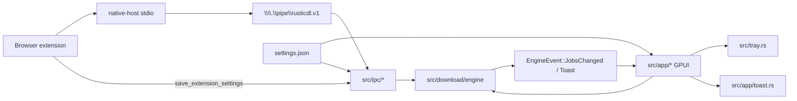
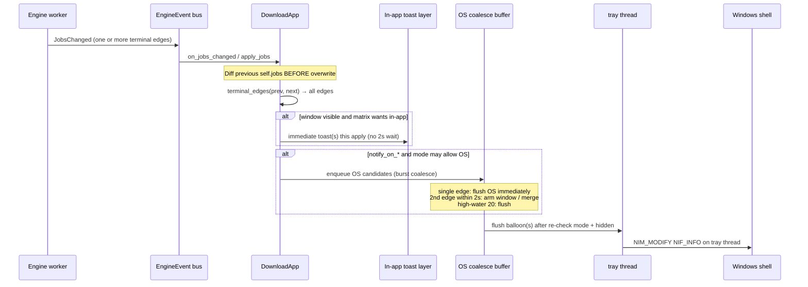
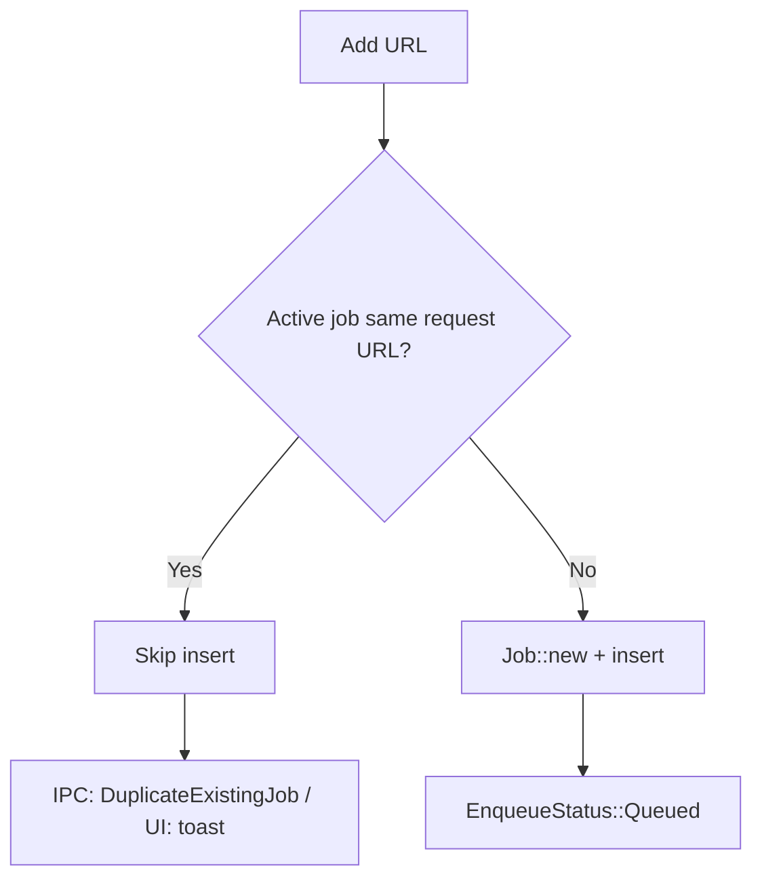
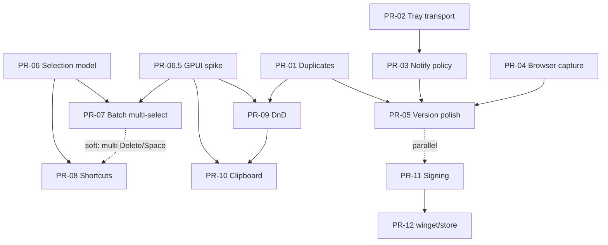

# RusticDL Near-Term Product Plan (v0.2 Foundation)

| Field | Value |
| --- | --- |
| **Document title** | RusticDL Near-Term Product Plan (v0.2 Foundation) |
| **Author** | design-doc-writer (for JustNak / RusticDL) |
| **Date** | 2026-08-11 |
| **Status** | Ready for implementation (rev 4 — user decisions incorporated) |
| **Baseline version** | 0.1.4 (`Cargo.toml`) |
| **Workspace** | `C:\Users\ZeusVeilmon\Desktop\Project\Program\RustyDownloadManager` |

---

## Overview

RusticDL is a local-first HTTP(S) download manager for Windows (GPUI + Rust). Version **0.1.4** already delivers a solid queue, appearance system, browser extension handoff via named pipe `\\.\pipe\rusticdl.v1`, close-to-tray, startup integration, and GitHub Releases auto-update. Trust and polish gaps remain: when the window is tray-hidden (default UX), **terminal job outcomes have no OS feedback and no completion toast**—users only notice finishes/failures by looking at the queue UI while the window is visible. Duplicate handling differs between browser IPC and the manual Add path. Browser-capture preferences are only editable from the extension popup/options—not the desktop Settings UI.

This document is an **implementation-ready plan for Phase A** (after rev 2 clarifications). **Phase B is ticketable with explicit GPUI interaction spikes** before feature PRs. **Phase C** is ops/distribution notes.

- **Phase A** — Polish / trust: OS completion notifications, unified duplicate policy, desktop Browser Capture settings panel (plus only those maintainability splits that unblock the work).
- **Phase B** — Power UX: multi-select + batch actions, keyboard shortcuts, drag-and-drop URLs / optional clipboard watch (**gated on GPUI spikes**).
- **Phase C** — Distribution notes: code signing, extension store path, winget packaging.

Explicit non-goals (README “by design” and this plan’s PR deliverables): torrents/magnets, multi-connection segmented downloads, bulk archive finalize, Linux/macOS ports.

---

## Background & Motivation

### Current architecture (as implemented)



| Area | Key files | Notes (verified ~2026-08-11) |
| --- | --- | --- |
| Root view / orchestration | `src/app/mod.rs` (~1000 LOC) | `DownloadApp`, selection, toasts, tray hide flag, settings save; already split into sibling modules |
| Queue / dialogs (extracted) | `queue_view.rs`, `add_dialog.rs`, `confirm_dialogs.rs`, `sidebar.rs`, `title_bar.rs`, `status_bar.rs`, `update_flow.rs`, `about_dialog.rs` | UI surface split from root view |
| Settings UI | `src/app/settings_panel.rs` (~980 LOC) | GroupBoxes: **General / System / Appearance / Data** |
| In-app toasts | `src/app/toast.rs` | Bottom-right stack; `ToastKind::{Info,Error}`; used for errors, multi-add, settings/update messages — **not** job complete/fail |
| Tray | `src/tray.rs` (~370 LOC) | Message-only HWND + `Shell_NotifyIconW` (`NIF_MESSAGE\|NIF_ICON\|NIF_TIP`, `NIM_ADD`/`NIM_DELETE`); events Show/Exit only |
| Settings model | `src/settings.rs` | `close_to_tray: true` default; `extension: ExtensionIntegrationSettings` |
| Extension prefs | `src/extension_settings.rs` | Source of truth for capture; protocol JSON round-trip |
| Engine | `src/download/engine/{mod,commands}.rs` | `EngineCommand::Add` always inserts; no URL dedupe |
| IPC (modular) | `src/ipc/mod.rs` (~17 LOC façade), `handlers.rs` (~260 LOC), `protocol.rs` (~340 LOC), `bridge.rs` (~200 LOC), `server.rs` (~190 LOC) | `find_active_duplicate` lives in **`handlers.rs`**; short-circuits enqueue/prompt before engine |
| Job model | `src/download/job.rs` | `JobState`, `is_active` (`#[allow(dead_code)]` today) / `is_terminal` |
| Branding | `src/branding.rs` | `APP_USER_MODEL_ID = "com.rusticdl.app"` (set at process start in `main.rs`) |

### Pain points this plan addresses

1. **Silent completions when tray-hidden (and thin feedback even when visible)**  
   Close-to-tray is **on by default** (`Settings::close_to_tray`). `DownloadApp::window_hidden_to_tray` tracks hide state.  
   **Today there is no OS notification and no in-app completion/failure toast.** Terminal outcomes (`Completed` / `Failed` after retries) appear only as **queue list / detail panel state** while the main window is shown. Engine `EngineEvent::Toast` is used for add validation / multi-URL paste messages (`commands.rs`), not for terminal job outcomes. When the window is `SW_HIDE` (default close-to-tray UX), the user gets **zero** feedback that a long download finished or failed. Phase A adds OS balloons and **new** optional in-app terminal toasts (see A1 matrix)—these are product additions, not preservation of existing toast policy.

2. **Duplicate policy inconsistency**  
   IPC (`enqueue_download` / `prompt_download` in **`src/ipc/handlers.rs`**) calls private `find_active_duplicate` and returns `EnqueueStatus::DuplicateExistingJob` for the same URL in `Queued | Starting | Downloading | Paused`. Manual Add (`add_dialog` → `EngineCommand::Add`) and engine command handling (`commands.rs`) never check duplicates—users can queue the same URL many times from the desktop UI.

3. **Extension settings only in the browser**  
   Desktop persists `Settings.extension` and IPC `save_extension_settings` updates it, but Settings UI never exposes those fields. Extension options (`apps/extension/src/options/`) are the only editor. Desktop users cannot configure capture without opening the extension.

4. **Power UX gaps** (Phase B)  
   Selection is single-id **toggle** (`selected_id: Option<String>` in `DownloadApp`; row click in `job_row.rs` deselects if already selected). No multi-select, no global shortcuts beyond dialog Escape, no DnD / clipboard watch. GPUI modifier-click and drop APIs are **unproven** in this codebase (row `on_click` currently ignores the event payload).

### Constraints preserved

- Single-stream HTTP with Range resume (no multi-connection in this plan).
- Local-first; no cloud accounts.
- Extension remains untrusted; desktop re-validates URLs (see `docs/protocol.md`).
- Incremental, mergeable PRs; prefer enabling refactors only when they unblock features.

---

## Goals & Non-Goals

### Goals

| ID | Goal | Phase |
| --- | --- | --- |
| G1 | Show Windows completion/failure notifications, especially when tray-hidden | A |
| G2 | One duplicate policy for IPC + manual Add + engine | A |
| G3 | Desktop Settings “Browser capture” panel mirrors extension capture fields | A |
| G4 | Optional small module splits only if they unblock A/B | A |
| G5 | Multi-select + batch pause/retry/remove/open folder without breaking detail panel | B |
| G6 | Keyboard shortcuts for common queue ops | B |
| G7 | Drag-and-drop URLs; optional clipboard watch (off by default) | B |
| G8 | Document code signing, store listing, winget path | C |

### Non-Goals

- Torrents / magnets
- Multi-connection segmented downloads (future big bet only)
- Bulk archive finalize
- Linux / macOS ports
- Categories/tags, scheduling, SHA-256 verify, bandwidth sparkline (backlog only)
- Redesigning appearance system or protocol v2
- Making `app/mod.rs` line-count reduction a product goal (already modular; Phase B may add `selection.rs` / `shortcuts.rs` as enablers)
- Escape hatch for intentional dual active downloads of the same URL in 0.2 (no `allow_duplicate_urls` setting)

---

## Proposed Design

### Phase A — Polish / trust

#### A1. Windows completion notifications

##### Problem detail

- **Current feedback surface for terminal jobs:** queue row + detail panel only (state labels, progress 100%, error text). **No** completion/failure toasts; **no** OS notify.
- Engine toasts exist only for empty/invalid URL and multi-URL paste (`emit_toast` in `commands.rs`).
- Terminal transitions happen in the engine worker finalizer (`src/download/engine/mod.rs`): after the retry loop exhausts (or succeeds), state becomes `Completed` / `Failed` / `Canceled` then `emit_jobs_locked`. Intermediate retry states stay non-terminal (`Starting` with retry message)—**only the final `Failed` after retries is a notify edge**.
- There is **no** dedicated `EngineEvent::JobTerminal` today—UI sees state diffs via `JobsChanged`. `on_jobs_changed` throttles UI apply to ~80ms via `pending_jobs`; edge-detect must run on the **applied** snapshot and count **all** terminal edges in that apply.

##### Design: notification policy + dual pipelines (in-app vs OS)

Terminal edges feed **two independent pipelines**. They must not share a single “wait 2s then maybe toast” path.



**New module:** `src/notifications.rs` (policy helpers, truncation, OS coalesce types; Windows notify calls into tray).

**Edge detection (must run before overwrite):**

```rust
// In apply_jobs — order matters:
// 1. let edges = terminal_edges(&self.jobs, &jobs);  // previous = self.jobs
// 2. Pipeline A — in-app: if window visible, apply matrix immediately (below)
// 3. Pipeline B — OS: push candidates into coalesce buffer; maybe flush (below)
// 4. self.jobs = jobs;  // then existing persist / ipc / selection prune
//
// Count EVERY id that transitions non-terminal → Completed or Failed in this snapshot.
// Do not stop at first edge (many completes can land in one throttled apply_jobs).
```

**Notify on:** final `Completed`; final `Failed` (after auto-retry exhaustion—engine only sets `Failed` when retries are done; see retry loop in `engine/mod.rs`).  
**Do not notify on:** `Paused`; intermediate retry `Starting`; **user `Canceled` (never OS balloon, never terminal in-app toast)** — settled product decision.

**Copy (single event):**

| Kind | Title (truncate 63 UTF-16 units) | Body (truncate 255 UTF-16 units) |
| --- | --- | --- |
| Completed | Download complete | `{filename}` |
| Failed | Download failed | `{filename}` — `{error}` |

Use `APP_NAME` only if title space allows; prefer short titles above.

##### Windows API choice (aligned with existing stack)

**Primary (Phase A):** **Tray balloon** via existing tray infrastructure (`src/tray.rs`).

Today: `NIF_MESSAGE | NIF_ICON | NIF_TIP`, `NIM_ADD` / `NIM_DELETE` only—no `NIF_INFO`, no `NIM_MODIFY`, no balloon click handling.

**PR-02 implementation contract (transport):**

1. **Cross-thread:** UI/engine never call `Shell_NotifyIconW` from the GPUI thread on the tray’s icon. `SystemTray::show_notification(title, body, level, context_id)` **posts a custom message** (e.g. `WM_APP + 41`) to the tray message HWND (`AtomicIsize`), carrying owned wide strings + a **`u32`/`u64` context token** (or heap box the tray thread frees). Tray thread performs `NIM_MODIFY` with `NIF_INFO` (+ keep `NIF_MESSAGE | NIF_ICON | NIF_TIP` as needed) and remembers **`active_balloon_context_id`** for the currently displayed balloon.
2. **Balloon click (transport):** In `tray_wnd_proc` / `WM_TRAYICON`, handle `NIN_BALLOONUSERCLICK` (and optionally `NIN_BALLOONTIMEOUT` as clear-active-context no-op). Emit **`TrayEvent::BalloonUserClick { context_id }`** (not bare `ShowWindow`—policy layer maps the click). Timeout clears the active context id without notifying UI.
3. **Truncation helpers:** `truncate_utf16_units(s, max)` for title **64** WCHARs and info **256** WCHARs (leave room for NUL as required by `NOTIFYICONDATAW` fields—use max 63 / 255 content units).
4. **No-op:** if `hwnd == 0` or tray not started, `show_notification` returns quietly (caller may log `eprintln!`).
5. **Version:** set `NOTIFYICONDATAW.uVersion` / `NIM_SETVERSION` if needed for consistent balloon callbacks on modern Windows (implementer verifies; not a hard blocker if default path works in QA).
6. **QA:** manual test on **Windows 10 and Windows 11** (balloons may surface as legacy tray tips / notification-area behavior on Win11). Note Focus Assist may suppress tips—smoke once with Focus Assist on.
7. **`Cargo.toml`:** `Win32_UI_Shell` already present; extra features likely unnecessary.

**Deferred:** WinRT Action Center toasts (`ToastNotificationManager` + XML)—larger packaging surface; follow-up if balloon UX insufficient.

##### Balloon click policy (settled — Phase A)

**Product decision:** clicking a balloon **always restores/focuses the main window**. When the balloon represents a **single Completed** job, also **open the downloaded file** via the existing open-file helper (`open_path` / same path as detail “Open”). For **Failed**, **coalesced multi-job**, or **open failure**, show/focus app only (optional error toast if open fails).

**Context map (UI/policy owns job data; tray only stores opaque id):**

```rust
struct BalloonClickContext {
    context_id: u64,           // token passed to tray with show_notification
    kind: BalloonOutcome,      // SingleComplete | SingleFail | Coalesced
    /// Present only for SingleComplete (and optionally SingleFail for future Retry).
    job_id: Option<String>,
    /// Snapshot of target path at notify time (Completed only); avoids racing remove.
    target_path: Option<PathBuf>,
}

// On DownloadApp / notifications module:
next_balloon_context_id: u64,
/// Ring buffer of last N (e.g. 8) contexts so a late click still resolves.
balloon_contexts: VecDeque<BalloonClickContext>, // cap N = 8
```

**On OS flush (Pipeline B):**

1. Allocate `context_id = next_balloon_context_id++`.
2. Build context:
   - **1 complete:** `SingleComplete` + `job_id` + `target_path` from job (clone `PathBuf` at flush).
   - **1 fail:** `SingleFail` + `job_id` (no open-on-click).
   - **N≥2 or mixed:** `Coalesced` (no single path; click = show app only).
3. Push onto `balloon_contexts` (drop oldest if `len > 8`); call `show_notification(..., context_id)`.

**On `TrayEvent::BalloonUserClick { context_id }`:**

1. Always: `pending_tray_show` / `show_main_window` (same as today’s ShowWindow path).
2. Lookup `context_id` in `balloon_contexts` (ignore if missing/expired).
3. If `SingleComplete` and `target_path` is `Some`: call `open_path(&path)`; on `Err`, `show_error_toast` (do not fail the show-window step).
4. If `SingleFail` / `Coalesced` / open skipped: show window only.
5. Do **not** re-open on balloon timeout; only user click.

**Security:** open only the path snapshotted at notify time for that job’s completed target (never raw user text from the balloon body). Path is app-controlled from job state.

##### Tray lifetime (product rule)

Balloons require a live tray icon. Today tray starts only when `close_to_tray || started_minimized` (`DownloadApp::new`) and is **stopped** when close-to-tray is turned off and the window is not hidden (`set_close_to_tray` / `save_settings`).

**Rule (Phase A):**

```text
tray_needed = close_to_tray
           || window_hidden_to_tray
           || started_minimized (startup path)
           || os_notify_mode != Off
```

- On settings load, toggle, and **Save settings**: if `os_notify_mode != Off`, call `ensure_tray`; only `stop_tray` when `os_notify_mode == Off` **and** `!close_to_tray` **and** `!window_hidden_to_tray`.
- **Always** mode with close-to-tray off → tray icon still present for balloons (lightweight “notification area” presence). Document in System hint: “OS notifications use the tray icon even if Close to tray is Off.”
- If tray creation fails (`SystemTray::start` → `None`), OS notify is silently skipped; in-app toasts still follow the matrix when the window is visible. Optional one-time error toast on first failure is **not** required for v1.

##### Settings fields

Add to `Settings` (`src/settings.rs`, camelCase JSON, `#[serde(default)]`):

```rust
#[derive(Debug, Clone, Copy, PartialEq, Eq, Serialize, Deserialize, Default)]
#[serde(rename_all = "snake_case")]
pub enum OsNotifyMode {
    /// Only when the main window is hidden to the tray (recommended).
    #[default]
    WhenHiddenToTray,
    /// Always fire OS notification (subject to tray availability).
    Always,
    /// Never use OS notifications.
    Off,
}

pub os_notify_mode: OsNotifyMode,
#[serde(default = "default_true")]
pub notify_on_complete: bool,
#[serde(default = "default_true")]
pub notify_on_fail: bool,
```

Defaults: `WhenHiddenToTray`, both toggles **true**.

**UI (System GroupBox):** mode Off / When hidden / Always; toggles for complete/fail.  
**Persistence:** same as other System toggles — **mutate in memory immediately; disk write only on “Save settings”**. Field hint on the section: “Saved with Save settings.” (See also A3 / Issue 9 alignment.)

##### Dual pipelines (normative)

On each `apply_jobs`, after computing `edges = terminal_edges(prev, next)` (all of them), run **A then B**. Filter edges by `notify_on_complete` / `notify_on_fail` **before** both pipelines (user toggles apply to both surfaces).

###### Pipeline A — in-app toasts (immediate; never uses the 2s OS timer)

**When:** main window is **visible** (`!window_hidden_to_tray`) **and** the terminal matrix (below) asks for in-app feedback for that edge kind.

**When not:** tray-hidden → **no** in-app terminal toasts (user cannot see them).

**Latency:** fire on **this** `apply_jobs` call—**zero** dependency on OS coalesce buffer or deadlines.

**Aggregation (same apply only):** if `edges` has multiple kinds eligible for in-app in this snapshot, prefer **one summary Info/Error toast per kind** (e.g. `"3 downloads finished"`, `"2 downloads failed"`) rather than N stacked toasts. Do **not** wait for edges from future applies.

**Matrix mapping (visible window only):**

| Mode | Completed (in-app) | Failed (in-app) |
| --- | --- | --- |
| WhenHiddenToTray | Info toast | Error toast |
| Always | **none** (OS covers success) | Error toast |
| Off | Info toast | Error toast |

###### Pipeline B — OS balloons (burst coalesce only)

**Eligibility at enqueue time (soft filter):** edge passes `notify_on_*` and `os_notify_mode != Off`. Do **not** require “currently tray-hidden” at enqueue for `WhenHiddenToTray`—**hard eligibility is re-checked at flush** (user may hide/show between edges).

**Buffer fields** on `DownloadApp` (or `notifications` helper):

```rust
struct PendingOsTerminal {
    kind: TerminalKind, // Complete | Fail
    filename: String,
    error: Option<String>,
}

// OS pipeline only:
pending_os_terminals: Vec<PendingOsTerminal>,
os_coalesce_deadline: Option<Instant>, // Some only while a multi-edge window is open
```

**Burst coalesce algorithm (normative — no always-wait-2s on singles):**

State: `pending_os_terminals`, `os_coalesce_deadline: Option<Instant>`, `burst_open_until: Option<Instant>`.

On each `apply_jobs` (Pipeline B), for the batch of soft-eligible edges in **this** snapshot:

1. **Append** all soft-eligible edges from this snapshot to `pending_os_terminals`.
2. **Same-snapshot decision:**
   - If `pending` was empty before this append and this snapshot contributed **exactly one** edge **and** `burst_open_until` is `None` or expired: **flush immediately** (solitary job — no 2s delay).
   - If this snapshot contributed **two or more** edges (or buffer already held items from an open burst): **do not** flush one-by-one; keep buffer and ensure `os_coalesce_deadline` is set (see step 3), **or** if `len >= 20` go to high-water flush.
   - Practical rule: after appending the snapshot’s edges, if `len == 1` and no open burst window → flush now; if `len >= 2` → enter/continue burst (deadline) unless high-water.
3. **Cross-apply burst window:** after **any** successful or dropped OS flush, set `burst_open_until = now + 2s`.  
   - If a later apply’s first new edge arrives while `now < burst_open_until`, **hold** it (and any further edges) until `os_coalesce_deadline` (`= burst_open_until`) fires or high-water — this merges tight bursts without delaying true singles after the window expires.  
   - If the window is closed, the next solitary edge flushes immediately again (step 2).
4. **High-water:** if `pending_os_terminals.len() >= 20`, flush immediately (clear deadline).
5. **Deadline tick:** on render / existing timer paths, if `os_coalesce_deadline` elapsed, flush.
6. **At every OS flush, re-check hard eligibility** with **current** state (not enqueue-time soft filter):
   - `os_notify_mode == Off` → **drop** buffer (no balloon).
   - `WhenHiddenToTray` && `!window_hidden_to_tray` → **drop** OS buffer (user restored window; Pipeline A already ran when edges applied if visible then, else queue UI is enough).
   - `Always` → allow OS if tray available.
   - Re-apply `notify_on_complete` / `notify_on_fail` (user may have toggled).
   - Tray missing → drop after `eprintln!`.
7. After flush (fire or drop): clear `pending_os_terminals` and `os_coalesce_deadline`; set `burst_open_until = now + 2s` (step 3).

**Resulting UX:** solitary complete/fail → immediate balloon; many completes in one apply or within 2s → few coalesced balloons; never a fixed 2s tax on an isolated download.

**OS flush composition (mandatory — one rule only):**

| Buffer contents | Balloon |
| --- | --- |
| 1 complete | Title `Download complete`, body `{filename}` |
| 1 fail | Title `Download failed`, body `{filename}` — `{error}` |
| N≥2 all complete | Title `Downloads complete`, body `"{N} downloads finished"` |
| N≥2 all fail | Title `Downloads failed`, body `"{N} downloads failed"` |
| **Mixed completes + fails** | **Single combined balloon** (less spam): title `Downloads finished`, body `"{C} finished, {F} failed"` (use `NIIF_INFO` unless F>0 and C==0 which is pure-fail row). **Never** emit two balloons for one flush. |

Unit tests: single edge → OS flush without waiting 2s; multi-edge same apply → one coalesced flush; cross-apply within burst window → coalesced; mode Off / show window before flush → OS dropped; in-app still immediate when visible under WhenHiddenToTray.

##### Terminal feedback matrix (mode × window visibility)

**New UX** (nothing below exists for complete/fail today except queue UI). Read together with dual pipelines: **in-app is Pipeline A (immediate)**; **OS is Pipeline B (burst coalesce)**.

| `os_notify_mode` | Window visible | Window tray-hidden |
| --- | --- | --- |
| **WhenHiddenToTray** | In-app: success Info + failure Error (**immediate**). OS: no (and drop any pending OS on flush if user is visible) | In-app: no. OS: balloon (immediate single / coalesced burst) |
| **Always** | In-app: **failure Error only** (immediate). OS: balloon | In-app: no. OS: balloon |
| **Off** | In-app: success Info + failure Error (**immediate**). OS: no | In-app: no. OS: no |

Notes:

- Failures get in-app Error toast whenever the window is **visible** (all three modes).
- Success in-app: WhenHiddenToTray + Off when visible; suppressed under Always when visible (OS covers success).
- Solitary completions never wait 2s for OS; only **bursts** coalesce.
- Queue UI remains the source of truth in all cases.

##### Integration surface

| Component | Change |
| --- | --- |
| `src/tray.rs` | PostMessage show-balloon; `NIF_INFO` / `NIM_MODIFY`; `NIN_BALLOONUSERCLICK` → `TrayEvent::BalloonUserClick { context_id }`; truncation |
| `src/notifications.rs` | Edge types, **OS-only** coalesce, truncation, policy predicates, **balloon context map** (job_id / path / outcome) |
| `src/app/mod.rs` | Edge detect **before** `self.jobs = jobs`; dual pipelines; tray_needed; handle balloon click → show + optional `open_path` |
| `src/settings.rs` + settings_panel | New fields + System UI + “Saved with Save settings” hint |
| `Cargo.toml` | Only if extra windows features proven necessary |

##### Risks

| Risk | Severity | Mitigation |
| --- | --- | --- |
| Balloon deprecated UX on Win11 | Low | Still works; modern toast follow-up; QA both OS versions |
| No tray → no OS notify | Medium | **Tray lifetime rule**: keep tray when `os_notify_mode != Off` |
| Focus Assist suppresses tips | Low | Document; smoke test |
| Balloon storm / edge-detect bug | Medium | Coalesce; mode Off + Save + restart; no reinstall required |
| Focus steal | Low | Balloons do not activate until click |
| Double feedback Always + visible | Low | Matrix skips success in-app when Always |
| Open file after job removed | Low | Snapshot `target_path` at notify; open fails → toast, app still shown |
| Coalesced balloon open ambiguity | Low | Coalesced / fail → show app only (no multi-open) |

---

#### A2. Duplicate policy consistency

##### Current behavior

```text
IPC (handlers.rs) enqueue/prompt:
  find_active_duplicate(jobs, url)
    → same URL + state in {Queued, Starting, Downloading, Paused}
    → return existing job_id + DuplicateExistingJob
    → never calls engine for that URL

EngineCommand::Add (UI + any future callers):
  parse/split URLs → always Job::new + insert(0)
  no URL compare
  oneshot reply: first Queued outcome only; if added == 0, reply is dropped
```

Helper is **private** in `src/ipc/handlers.rs` (exact string match + match arms, not yet `JobState::is_active()`).

##### Target policy (single source of truth)

**Rule (v0.2):** For each URL being added, if an **active** job with the **exact same URL string** already exists (`JobState::is_active()` ≡ Queued/Starting/Downloading/Paused), **do not enqueue a second job**.

- **Completed / Failed / Canceled** with same URL: **allow** re-download (new job, unique paths via `allocate_unique_download_paths`).
- **URL equality:** exact string match on `job.url` only.
- **Paused counts as active** — intentional; matches current IPC (cannot start a second copy while paused).
- **Redirects:** `http.rs` follows redirects manually (`Policy::none`); **`job.url` remains the original request URL** (`current_url` is local to the download loop). Dedupe is on **request URL only**. Two different originals that redirect to the same file are **not** duplicates; original vs final response URL are **not** compared.
- **Signed CDN query strings / trailing slash / http vs https:** not normalized—intentional false-negatives so distinct signed URLs and scheme variants still enqueue. No final-URL or ETag/content-length dedupe in 0.2.
- **No escape hatch in 0.2:** no `allow_duplicate_urls` setting; intentional dual active download of the same URL is disallowed.

##### Engine `Add` decision table (oneshot + toast)

| Scenario | Jobs inserted | Oneshot `reply` (if `Some`) | Toast |
| --- | --- | --- | --- |
| All URLs invalid/empty | 0 | **Must not drop** — but UI rarely uses reply; for consistency if `added==0` and only dups (below) vs invalid: invalid path keeps today’s toast; if reply present and no outcome, IPC should not rely on engine (IPC validates first) | Existing invalid/empty toasts |
| All URLs active dups (1 or N) | 0 | `EnqueueOutcome { job_id: first_dup.id, filename, status: DuplicateExistingJob }` — **always send** (never drop reply on pure-dup) | `"Already downloading: {name}"` or `"Skipped N duplicate(s)."` |
| Mix skip + add | M > 0 | First **added** job as `Queued` (not first skipped dup) | `"Skipped N duplicate(s); added M."` when N>0 |
| All new | M | First added `Queued` | Multi-add toast only if M>1 (existing) |
| Single new | 1 | That job `Queued` | None (existing quiet single add) |

**Defense in depth:** IPC keeps fast-path short-circuit in `handlers.rs` **and** engine enforces the same rule. IPC dups never reach engine → **no double toast**. Engine path covers UI Add and any future callers.

##### Implementation

1. Move helper to `src/download/duplicates.rs` using `job.state.is_active()`.
2. Engine `Add` applies decision table; fix pure-dup reply drop.
3. IPC calls shared helper; delete private copy in `handlers.rs`.
4. Unit tests: pure helper; all-dup; mixed multi-URL; paused blocks; completed allows; reply always set when `Some` and pure-dup.



---

#### A3. Desktop “Browser capture” settings panel

##### Source of truth

`Settings.extension: ExtensionIntegrationSettings` (`src/extension_settings.rs`):

| Field | Type | Default | Extension options UI |
| --- | --- | --- | --- |
| `enabled` | bool | true | “Enable browser capture” |
| `download_handoff_mode` | Off / Ask / Auto | Ask | “Silent (auto)” → Auto vs Ask only; **Off not in options** |
| `context_menu_enabled` | bool | true | Context menu |
| `show_progress_after_handoff` | bool | true | not in options HTML |
| `show_badge_status` | bool | true | Toolbar badge |
| `excluded_hosts` | `Vec<String>` | `web.telegram.org` | textarea |
| `captured_file_extensions` | `Vec<String>` | large default list | text input |
| `download_capture_debug_logging` | bool | false | not in options UI |

**Not editable / not a real desktop setting:** protocol `ignoredFileExtensions` is always emitted as `[]` from `to_protocol_json()` and is **not** stored on `ExtensionIntegrationSettings`. **Omit from UI.**

Protocol sync already works (IPC `save_extension_settings` / `get_status`; UI pulls bridge in `apply_jobs`).

##### UI design

New **GroupBox “Browser capture”** after System, before Appearance.

Controls 1–8 as previously specified (enable, handoff Off/Ask/Auto, context menu, badge, show progress, excluded hosts, captured extensions, debug logging).

Hints: sync when extension connected; “Saved with Save settings.”

##### State / save path (aligned with System toggles)

**Persistence model (explicit):**

| Control type | In-session | Disk |
| --- | --- | --- |
| System + Browser capture booleans/enums (including notify mode) | Mutate `self.settings` immediately (preview) | **Only on “Save settings”** — same as `set_close_to_tray` today (does **not** call `save_settings`) |
| Text lists (hosts, extensions) | `InputState` draft | Parse + `extension.sanitize()` on Save |
| General numeric/dir fields | InputState draft | Save |

- On Save: `save_settings` + `ipc.update_settings` (existing path).
- Extension IPC writes still update disk immediately (bridge path)—when user opens Settings, refresh text inputs from `settings.extension` (**refresh-on-open Settings filter** for v1); do not clobber focused inputs mid-edit if we can detect focus (optional; v1 refresh-on-open is enough).
- **Do not** auto-save System/Browser toggles on each click in 0.2 (avoids behavior change vs close-to-tray); rely on section hints to prevent “sticky then gone” QA bugs.

##### No protocol changes

Wire format v1 unchanged. Desktop is another editor of the same object.

---

#### A4. Maintainability (enablers only)

| Split | Trigger | Suggested extraction |
| --- | --- | --- |
| Notifications | A1 | `src/notifications.rs` + tray balloon API |
| Duplicates | A2 | `src/download/duplicates.rs` |
| Settings browser section | A3 | Keep in `settings_panel.rs` unless it exceeds ~1.2k; optional impl block file |
| Engine events | Optional | Prefer UI edge-detect; `EngineEvent::JobTerminal` only if edge-detect becomes fragile |
| Phase B | After spike | `selection.rs`, `shortcuts.rs` if `mod.rs` / `queue_view.rs` get crowded |

`src/app/mod.rs` is already ~1k LOC with siblings (`queue_view`, dialogs, etc.). Hot spots for growth: `settings_panel.rs`, Phase B selection/keys—not a 2.5k monolith. **No pure split-for-size PRs.**

---

### Phase B — Power UX (ticketable; GPUI-gated)

Phase B interfaces are specified for tickets. **Do not schedule PR-07/09/10 as “normal” feature PRs until spike evidence lands.**

#### B0. GPUI interaction spike (gate)

Prove on a throwaway or minimal PR:

1. Row click receives modifier flags (Ctrl/Shift) or equivalent key state at click time.
2. Drop target on queue/empty state can accept text/URI lists.
3. Clipboard read on window focus (optional for clipboard PR).

**Fail closed:** if modifiers unusable, ship **checkbox column** multi-select (Alternative B) for v1 instead of Ctrl/Shift. If DnD blocked, defer PR-09. Document findings in spike PR description.

#### B1. Multi-select + batch actions

##### Selection model

Today: `selected_id: Option<String>` with **toggle** (click selected → deselect).

**Proposed:**

```rust
selected_ids: Vec<String>,
selection_anchor_id: Option<String>,
```

**Invariants:**

1. **Primary** = `selected_ids.last()` for detail panel when `len() == 1`. When `len() > 1`, show **batch action bar** (not multi-job detail).
2. **Click semantics:**

| Input | Behavior |
| --- | --- |
| Plain click | **Select only this id** (replace set); set anchor. **Does not toggle-off** — deliberate UX change from today |
| Ctrl+click | Toggle membership; primary = clicked |
| Shift+click | Range in **current visible sorted list** (`visible_jobs` / same order as rendered rows) from anchor → click |
| Click empty list chrome / non-row queue background | Clear selection |
| Escape (no dialog) | Clear selection |
| Job removed | `apply_jobs` retains only ids still present in `jobs` (generalize today’s single-id prune) |

3. **Deselect path after UX change:** Escape, empty-chrome click, or Ctrl+click toggle—not plain re-click. Call this out in release notes / PR-06.
4. **Filters:** keep selection across filters (ids may be off-screen).
5. **Row visual:** any id in `selected_ids` uses `list_active`.

##### Batch action bar

When `len() > 1`: Pause / Resume / Retry / Remove… / Open folder / Clear selection. Loop existing `EngineCommand`s; one confirm for multi-remove.

##### Risks

| Risk | Severity | Mitigation |
| --- | --- | --- |
| Loss of toggle-deselect | Medium | Document; Escape + empty chrome; Ctrl+click |
| Breaking single-click detail | High | Plain click still single primary + detail |
| Modifier keys unavailable | High | Spike gate; checkbox fallback |
| Selection stale after remove | Medium | Prune in `apply_jobs` |

---

#### B2. Keyboard shortcuts

Global when no text input focused and no modal dialog.

| Shortcut | Action |
| --- | --- |
| `Ctrl+N` | Add dialog |
| `Delete` | Confirm remove primary or multi-selection |
| `Space` | Pause/resume primary or all selected |
| `/` | Focus search |
| `Ctrl+,` | Settings filter |
| `Escape` | Clear multi-selection if any; else dialog dismiss |
| `Ctrl+A` | Select all visible (stretch) |

Module: `src/app/shortcuts.rs`. Soft-dep: multi Delete wants PR-07; single-select Delete can ship with selection model + confirm path.

---

#### B3. Drag-and-drop URLs / optional clipboard watch

- DnD: `extract_http_urls` → same enqueue path as Add (respects A2); needs shared enqueue helper with add dialog if not already centralized.
- Clipboard watch: `clipboard_watch_enabled` default **false**; prefer on **focus gain** only; toast + Add action, never auto-download; no background when tray-hidden in v1.
- Both gated on B0 spike results.

---

### Phase C — Distribution (ops / packaging)

Unchanged in substance: Authenticode in release CI; extension store checklist (CWS/Edge/AMO) + native-host allowed_origins for store id; winget `JustNak.RusticDL` notes; NSIS `UNINSTALLERSIGNCOMMAND` placeholder only today—no signing in `.github/workflows/release.yml`.

---

## API / Interface Changes

### Settings JSON (additive)

```json
{
  "closeToTray": true,
  "osNotifyMode": "when_hidden_to_tray",
  "notifyOnComplete": true,
  "notifyOnFail": true,
  "clipboardWatchEnabled": false,
  "extension": { }
}
```

### Engine / IPC

| Surface | Change |
| --- | --- |
| `find_active_duplicate` | `src/download/duplicates.rs`; used by engine + `handlers.rs` |
| `EngineCommand::Add` | Decision table; pure-dup **always** replies `DuplicateExistingJob` |
| `EngineEvent` | No required change for A1 |
| Protocol v1 | Unchanged |

### Tray API (internal)

```rust
impl SystemTray {
    /// Posts to tray thread; no-op if hwnd == 0.
    /// `context_id` is echoed on BalloonUserClick for policy lookup.
    pub fn show_notification(
        &self,
        title: &str,
        body: &str,
        level: NotifyLevel,
        context_id: u64,
    );
}

// TrayEvent (extend):
//   ShowWindow | Exit | BalloonUserClick { context_id: u64 }
// tray thread: NIM_MODIFY + NIF_INFO; NIN_BALLOONUSERCLICK → BalloonUserClick
```

### Selection API (Phase B)

```rust
fn primary_selected_id(&self) -> Option<&str>;
fn is_selected(&self, id: &str) -> bool;
fn select_only(&mut self, id: String);
fn toggle_select(&mut self, id: String);
fn select_range_visible(&mut self, to_id: &str, visible: &[Job]);
fn clear_selection(&mut self);
fn prune_selection(&mut self, jobs: &[Job]);
```

---

## Data Model Changes

| Store | Change | Migration |
| --- | --- | --- |
| `settings.json` | Notify + clipboard fields | Defaults on missing keys |
| `state.json` | None | — |
| Selection | Phase B multi ids | Not persisted |
| Coalesce buffer | In-memory only | — |

---

## Alternatives Considered

### Notifications

| Alternative | Pros | Cons | Decision |
| --- | --- | --- | --- |
| **A. Tray balloon (NIF_INFO)** | Fits tray HWND; minimal deps | Older UX on Win11 | **Choose Phase A** |
| B. WinRT Toast XML | Action Center; action buttons | WinRT features; packaging | Future |
| C. Only queue UI | Trivial | Fails tray-hidden trust | Reject as sole approach |
| D. Engine Toast on every complete | Simple | No mode policy; multi-job noise | Prefer UI edge-detect + policy |
| E. Engine `JobTerminal` event | Explicit | Extra engine API | Defer; UI edge-detect first |
| F. Taskbar flash (`FlashWindowEx`) only | Attention without balloon | No message content; poor for failures | Reject as primary; optional later |

### Duplicate policy

| Alternative | Pros | Cons | Decision |
| --- | --- | --- | --- |
| **A. Skip active URL in engine** | All entry points consistent | No dual active same URL | **Choose** |
| B. UI-only check | Small | Drift | Reject |
| C. `allow_duplicate_urls` setting | Flexible | Extra UX | **Deferred; no 0.2 escape hatch** |
| D. Dedupe completed too | Cleaner queue | Blocks re-download | Reject |
| E. Dedupe by final redirect URL or ETag | Catches alias URLs | Complex; breaks signed URLs | Out of scope |

### Browser capture UI

| Alternative | Pros | Cons | Decision |
| --- | --- | --- | --- |
| **A. Settings GroupBox** | Discoverable | Longer settings page | **Choose** |
| B. Sidebar nav item | More room | IA change | Overkill |
| C. Link only to extension | No desktop work | Fails desktop-only users | Reject |

### Multi-select

| Alternative | Pros | Cons | Decision |
| --- | --- | --- | --- |
| **A. selected_ids + primary last + batch bar N>1** | Detail stays for single | Loses plain-click toggle-deselect | **Choose** (document change) |
| B. Checkbox column | No modifier dependency | Layout density | **Fallback if spike fails** |
| C. Batch-only UI | Simple | Loses detail | Hybrid only |

---

## Security & Privacy Considerations

| Topic | Notes |
| --- | --- |
| Notifications content | Filename + short error only; never cookies, handoffAuth, sensitive paths |
| Balloon click | Show/focus app; **Completed single** also opens snapshotted `target_path` via `open_path` (app-owned path, not balloon text). Fail/coalesced/open-error → show app only |
| Extension settings | Same `sanitize` as IPC; `ignoredFileExtensions` not editable |
| Clipboard watch | Off by default; HTTP(S) only; no upload |
| Duplicate short-circuit | Avoids double fetch of authenticated URLs |
| Named pipe | Unchanged |
| Runaway balloons | User sets `osNotifyMode: off`, Save settings, restart app—no reinstall; failures only `eprintln!` unless tray start fails repeatedly |
| Code signing (C) | Private key never in repo |

---

## Observability

| Signal | How |
| --- | --- |
| Notify / tray failures | `eprintln!("[rusticdl] notify: …")` |
| Duplicate skips | User-visible toast counts |
| Capture debug | `download_capture_debug_logging` |
| Release health | GitHub download counts; SmartScreen after signing |

No remote telemetry.

---

## Rollout Plan

### Feature flags

User settings only: `os_notify_mode`, notify toggles, later `clipboard_watch_enabled`. Safe defaults: WhenHiddenToTray; clipboard off.

### Staged delivery

1. Phase A PRs → ship as **0.2.0** (settled; PR-05 bumps version).
2. Phase B after B0 spike.
3. Phase C parallel when cert available.

### Rollback

- `osNotifyMode: off` in settings JSON or via UI + Save.
- Revert duplicate PR if needed.
- Unsigned zip remains available if signing fails.

### Testing checklist (Phase A)

**Notify / tray**

- [ ] Complete while window visible + `WhenHiddenToTray` → **new** in-app success toast **immediately** (no 2s wait); no balloon
- [ ] Fail while visible + `WhenHiddenToTray` → **new** in-app error toast immediately; no balloon
- [ ] Complete while tray-hidden → balloon **immediately** for solitary job; **click restores window and opens file**
- [ ] Fail balloon click → restores/focuses app **only** (does not open a path)
- [ ] Coalesced multi-complete balloon click → show app only (no multi-file open)
- [ ] Completed balloon click after file deleted/moved → show app + error toast; no panic
- [ ] User **Canceled** job → **no** OS balloon and **no** terminal in-app toast
- [ ] Fail after **retries exhausted** only → one fail balloon (not intermediate retry; not cancel)
- [ ] `Off` → never balloon; visible still gets new in-app terminal toasts immediately
- [ ] `Always` + visible → OS balloon; success in-app suppressed; failure in-app immediate
- [ ] `Always` + `close_to_tray: false` → tray still created; balloons work
- [ ] Same-apply multi-complete → one coalesced balloon; solitary never delayed ~2s
- [ ] Burst: 50 tiny completes across applies within window → few coalesced balloons; not 50
- [ ] Mixed complete+fail flush → **one** combined body `"{C} finished, {F} failed"` (not two balloons)
- [ ] Restore window after edge enqueued but before OS flush under WhenHiddenToTray → OS dropped
- [ ] Mode Off mid-session + Save → no further OS balloons without reinstall
- [ ] Win10 + Win11 manual smoke; Focus Assist on once

**Duplicates**

- [ ] IPC active dup → `duplicate_existing_job`; no second row; no engine double toast
- [ ] Manual Add same URL while downloading → toast; no second row
- [ ] Manual Add while **paused** same URL → blocked
- [ ] Re-Add after Completed → new job allowed
- [ ] Multi-URL paste: partial dups → skip N, add M toast
- [ ] All-dup multi-URL with oneshot (if tested via engine) → `DuplicateExistingJob` reply not dropped
- [ ] Two different URLs that redirect to same file → **both** enqueue (request-URL dedupe)

**Browser capture / settings**

- [ ] Save Browser capture → extension `get_status` reflects values
- [ ] Extension save → desktop Settings shows updates after reopen Settings
- [ ] Toggle System/Browser without Save → restart loses toggles (document; matches close-to-tray)
- [ ] Legacy `settings.json` without new keys loads
- [ ] `ignoredFileExtensions` not shown in UI

---

## Key Decisions

1. **OS notifications via tray balloon (NIF_INFO), not WinRT toasts (Phase A)**  
   Reuses `src/tray.rs` HWND + Shell APIs; unblocks tray-hidden trust with minimal surface.

2. **Default notify mode = `WhenHiddenToTray`**  
   Aligns with default close-to-tray without always double-notifying.

3. **Terminal edges detected in UI (`apply_jobs`) before overwriting `self.jobs`; dual pipelines**  
   In-app toasts fire **immediately** when visible (matrix). OS balloons use **burst coalesce only** (single flush immediate; 2s window only for multi-edge bursts; re-check mode + `window_hidden_to_tray` at flush). Count all edges per snapshot.

4. **Tray stays alive when `os_notify_mode != Off`**  
   Even if close-to-tray is off, so `Always` is not a silent no-op. Tray stop only when notify Off and tray not otherwise required.

5. **In-app terminal toasts are new UX**  
   Completions/failures do not toast today. Phase A introduces them per the mode × visibility matrix—not “preserve existing toast policy.” **Canceled never gets a terminal toast.**

6. **Duplicate policy enforced in `EngineCommand::Add` + IPC fast-path**  
   Defense in depth; pure-dup must reply `DuplicateExistingJob`; no double toast when IPC short-circuits.

7. **Active-only exact `job.url` dedupe; redirects do not rewrite `job.url`**  
   Request-URL identity only; completed re-downloads allowed; **no 0.2 escape hatch** for dual active same URL.

8. **Browser capture GroupBox on `Settings.extension`; omit `ignoredFileExtensions`**  
   No protocol change; Save + `ipc.update_settings`.

9. **System / Browser / notify toggles: in-memory immediately, disk on Save settings**  
   Matches existing `set_close_to_tray`; section hints prevent false “sticky” expectations.

10. **Multi-select: `selected_ids` + primary last; batch bar when N>1; plain click no longer toggle-deselects**  
    Deliberate UX change; Escape / empty chrome / Ctrl+click deselect.

11. **Phase B gated on GPUI spike; checkbox multi-select is the fail-closed fallback**  
    Do not bet the schedule on unproven modifier-click.

12. **Clipboard watch opt-in default off**  
    Privacy-preserving.

13. **No torrents / multi-connection in PR deliverables**  
    Protects README scope.

14. **Phase C is ops-first**  
    Signing/store/winget do not block Phase A code.

15. **Balloon click = show app; single Completed also opens file**  
    Policy owns a last-N context map (`context_id` → outcome / `job_id` / snapshotted `target_path`). Tray echoes opaque `context_id` on `BalloonUserClick`. Failed/coalesced → show only; open uses existing `open_path`.

16. **No notifications for Canceled**  
    Only `Completed` and final `Failed` (after retries) participate in either pipeline.

17. **Phase A ships as 0.2.0**  
    PR-05 bumps `Cargo.toml` / README to **0.2.0** (not 0.1.5).

---

## Open Questions

1. ~~**Cancel notifications**~~ — **Decided: No.** Only Completed and Failed (after retries). Canceled never OS-notifies or terminal-toasts.
2. ~~**Balloon click action**~~ — **Decided: Show app + open file when single Completed.** Failed/coalesced/open-error → show/focus app only. Context map retains last N balloon payloads (see A1).
3. **Handoff mode Off copy** vs extension context-menu behavior—product wording.
4. ~~**Semver**~~ — **Decided: 0.2.0** after Phase A (PR-05).
5. **GPUI modifier-click / DnD:** Resolved by B0 spike, not a product open question once spike lands.
6. **Burst window length / high-water:** 2s / 20—tunable after QA; singles stay immediate.
7. **Certificate provider** for Authenticode?

---

## Future / Backlog (not PR deliverables)

- Multi-connection segmented downloads; Linux/macOS; categories/tags; scheduling; SHA-256; sparklines
- WinRT toasts with Open/Retry
- `allow_duplicate_urls`
- Full extension options parity
- Engine batch remove commands
- Dedupe by final URL / ETag

---

## References

| Resource | Path |
| --- | --- |
| README non-goals | `README.md` |
| Protocol | `docs/protocol.md` |
| Settings model | `src/settings.rs` |
| Extension settings | `src/extension_settings.rs` |
| Engine commands | `src/download/engine/commands.rs` |
| Engine finalizer / retry | `src/download/engine/mod.rs` |
| HTTP redirects (`job.url` stable) | `src/download/http.rs` |
| IPC façade | `src/ipc/mod.rs` |
| IPC handlers / duplicates | `src/ipc/handlers.rs` (`find_active_duplicate`) |
| IPC protocol / bridge / server | `src/ipc/{protocol,bridge,server}.rs` |
| In-app toasts | `src/app/toast.rs` |
| Tray | `src/tray.rs` |
| Settings UI | `src/app/settings_panel.rs` |
| App root / queue split | `src/app/mod.rs`, `queue_view.rs`, `add_dialog.rs`, … |
| Job model | `src/download/job.rs` |
| Extension options | `apps/extension/src/options/` |
| Branding / AUMID | `src/branding.rs`, `src/main.rs` |
| Release workflow | `.github/workflows/release.yml` |
| Packager / NSIS | `Cargo.toml`, `installer/nsis/installer.nsi` |

---

## PR Plan

Incremental, independently reviewable PRs. Phase A first; Phase B after spike; Phase C parallelizable.

### PR-01 — Shared active-duplicate helper + engine enforcement

- **Title:** `fix(engine): unify active-URL duplicate policy for Add`
- **Files/components:** `src/download/duplicates.rs` (new), `src/download/mod.rs`, `src/download/engine/commands.rs`, **`src/ipc/handlers.rs`** (replace private helper; keep fast-path), unit tests
- **Dependencies:** none
- **Description:** Shared `find_active_duplicate` via `JobState::is_active()`. Engine decision table (all-dup reply, mixed toast). IPC defense in depth. Document request-URL-only / redirect behavior in test names.

### PR-02 — Tray balloon notification transport only

- **Title:** `feat(tray): balloon notifications via tray thread PostMessage`
- **Files/components:** `src/tray.rs` primarily; optional thin `src/notifications.rs` **transport** helpers only (truncation)—**no** settings policy or edge-detect
- **Dependencies:** none (parallel PR-01)
- **Description:** `SystemTray::show_notification(..., context_id)` posts to tray HWND; `NIM_MODIFY` + `NIF_INFO`; track active balloon context; `NIN_BALLOONUSERCLICK` → `TrayEvent::BalloonUserClick { context_id }`; no-op if hwnd 0; Win10/11 manual QA. Do **not** implement mode matrix or open-file here (policy in PR-03).

### PR-03 — Completion/failure notify policy + Settings + coalesce

- **Title:** `feat: Windows notifications on download complete/fail`
- **Files/components:** `src/settings.rs`, `src/app/mod.rs` (edge detect, dual pipelines, balloon context map + click → show/`open_path`), `src/app/settings_panel.rs`, `src/notifications.rs` (policy + coalesce + contexts), serde tests
- **Dependencies:** PR-02
- **Description:** Settings fields; mode × visibility matrix; dual pipelines; **Canceled excluded**; balloon context ring (last 8) with single-Completed click → show app + `open_path`; fail/coalesced → show only; tray lifetime when notify ≠ Off; full Phase A notify checklist.

### PR-04 — Desktop Browser capture Settings panel

- **Title:** `feat(settings): Browser capture panel for extension integration`
- **Files/components:** `src/app/settings_panel.rs`, `src/app/mod.rs` (input entities if needed, save path, refresh-on-open)
- **Dependencies:** none (parallel with PR-01–03)
- **Description:** GroupBox on `settings.extension`; omit `ignoredFileExtensions`; Save + `ipc.update_settings`; hints for Save persistence.

### PR-05 — Phase A release polish → **0.2.0**

- **Title:** `chore: bump to 0.2.0 and README notify/capture notes`
- **Files/components:** `README.md`, `Cargo.toml` version (`0.2.0`)
- **Dependencies:** PR-01, PR-03, PR-04
- **Description:** Version **0.2.0** (settled). Feature bullets for notifications, duplicate policy, browser capture settings.

### PR-06 — Selection model foundation (+ document deselect UX)

- **Title:** `refactor(ui): multi-select selection model with primary id`
- **Files/components:** `src/app/mod.rs`, `src/app/job_row.rs`, `src/app/detail.rs`, `queue_view.rs` as needed
- **Dependencies:** Phase A preferred for conflict reduction; none hard
- **Description:** `selected_ids` + anchor; plain click = select only (**no toggle-deselect**); prune in `apply_jobs`; Escape clear; empty-chrome clear. Single-select detail unchanged for N=1.

### PR-06.5 — GPUI interaction spike (gate for Phase B features)

- **Title:** `spike(ui): prove modifier-click, drop target, focus clipboard APIs`
- **Files/components:** minimal harness or behind-cfg experiment; short findings in PR body
- **Dependencies:** none (can parallel PR-06)
- **Description:** Evidence for Ctrl/Shift on rows, DnD text, clipboard on focus. If modifiers fail → approve checkbox fallback for PR-07. **PR-07/09/10 must not merge without spike outcome.**

### PR-07 — Multi-select interactions + batch bar (largest Phase B risk)

- **Title:** `feat(ui): multi-select and batch actions`
- **Files/components:** selection handlers, `batch_bar`, confirm dialogs, `job_row`
- **Dependencies:** PR-06; **PR-06.5 success** (or explicit checkbox design from spike)
- **Description:** Ctrl/Shift or checkboxes; range on visible order; batch ops. Mark as may-slip if spike late. Largest review surface in Phase B.

### PR-08 — Keyboard shortcuts

- **Title:** `feat(ui): keyboard shortcuts for queue productivity`
- **Files/components:** `src/app/shortcuts.rs`, key capture in app root
- **Dependencies:** **PR-06** (hard) for selection targets and Escape clear; **PR-07 soft/optional** for multi-select Delete/Space over `selected_ids` (single-select Delete/Space ship with PR-06 alone)
- **Description:** Ctrl+N, Delete, Space, `/`, Ctrl+,, Escape clears selection. May merge before PR-07; multi-select shortcut behavior completes when PR-07 lands.

### PR-09 — Drag-and-drop URLs

- **Title:** `feat(ui): drag-and-drop HTTP(S) URLs onto queue`
- **Files/components:** queue/empty drop target; shared enqueue with add dialog; `extract_http_urls`
- **Dependencies:** PR-01 (dedupe); **PR-06.5 DnD evidence**; shared enqueue helper from add path
- **Description:** Drop text → engine Add; toast results.

### PR-10 — Optional clipboard URL watch

- **Title:** `feat: opt-in clipboard URL detection`
- **Files/components:** settings field, UI toggle, clipboard helper
- **Dependencies:** PR-06.5 clipboard evidence; soft-deps PR-09 for shared “offer add” UX
- **Description:** Default off; focus-gain only; toast + Add—no auto-download.

### PR-11 — Code signing pipeline (ops)

- **Title:** `ci: Authenticode sign release binaries and NSIS installer`
- **Files/components:** `.github/workflows/release.yml`, README notes
- **Dependencies:** certificate + secrets
- **Description:** Sign exe + setup; timestamp; hashes. NSIS sign placeholder exists only today.

### PR-12 — winget + store listing prep (docs/ops)

- **Title:** `docs: winget manifest notes and extension store checklist`
- **Files/components:** docs/README distribution section; sample manifests optional
- **Dependencies:** stable release assets (signed preferred)
- **Description:** CWS/AMO/Edge checklist; winget id; silent flags; store extension id → native-host registration.



---

*End of design document (rev 4 — user decisions: 0.2.0, no cancel notify, balloon click open file).*
