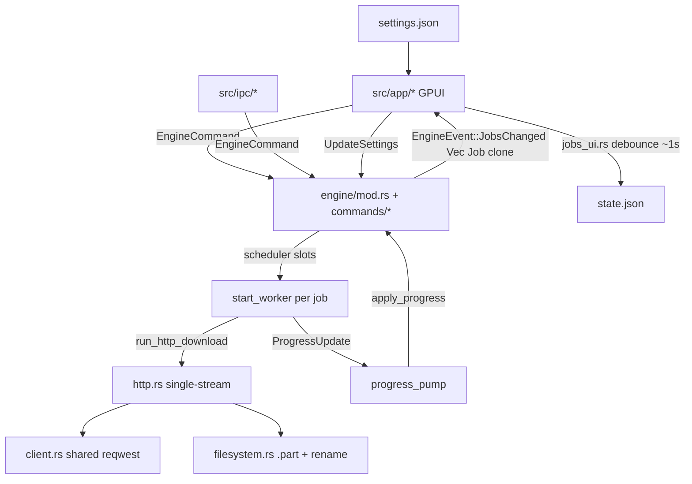
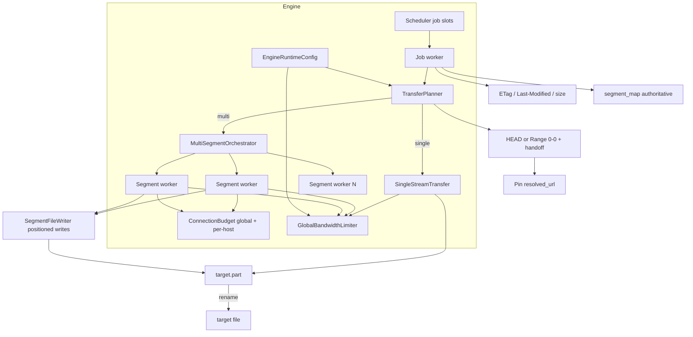
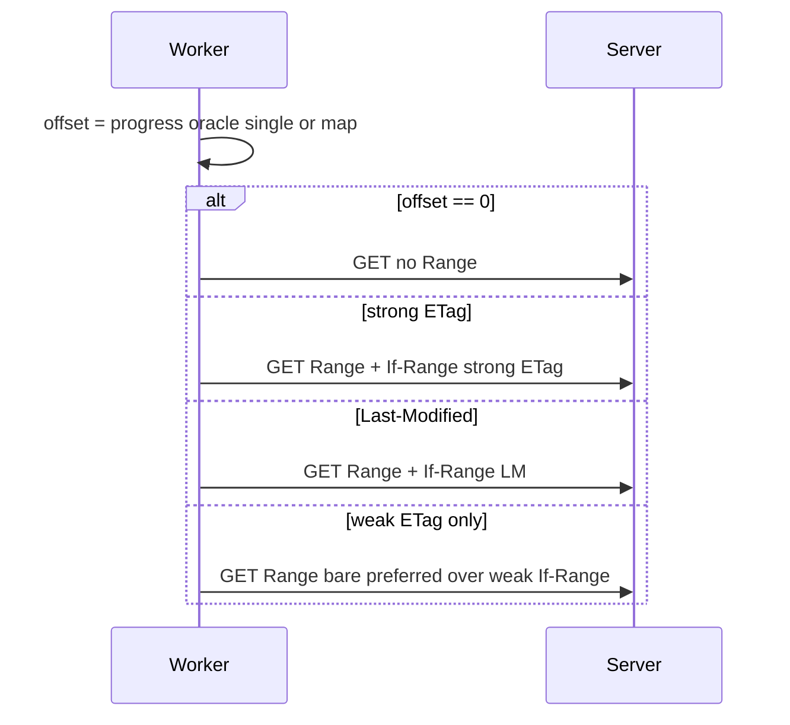
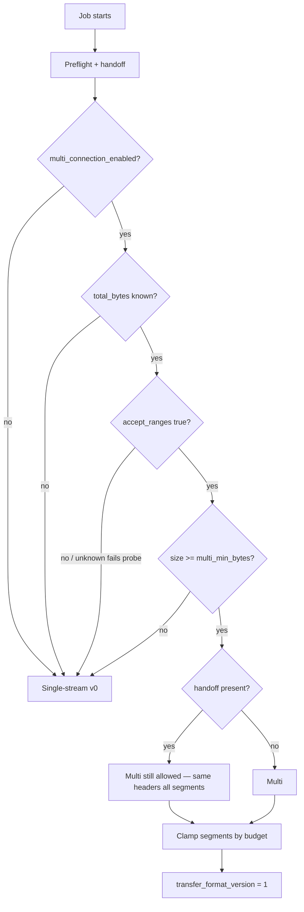
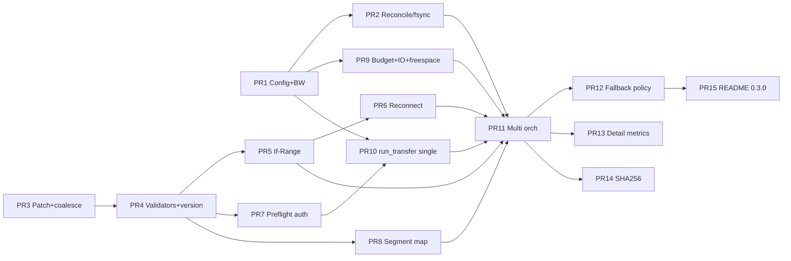

# Serious Download Manager Engine — RusticDL

| Field | Value |
| --- | --- |
| **Document title** | Serious Download Manager Engine — RusticDL |
| **Author** | design-doc-writer (for JustNak / RusticDL) |
| **Date** | 2026-08-12 |
| **Status** | Ready for implementation |
| **Baseline version** | 0.2.7 (`Cargo.toml`) |
| **Workspace** | `C:\Users\ZeusVeilmon\Desktop\Project\Program\RustyDownloadManager` |
| **Revision** | 4 — open-question lock-in (per-job segments DEFER; SHA-256 engine field first, no Add UI in plan) |

---

## Overview

RusticDL today is a solid **single-stream** HTTP(S) queue manager: real Range resume from `.part` length, pause/resume/cancel/restart, concurrent job slots, browser handoff auth, HTTP/2 + HTTP/3 fallback, and debounced queue persistence. That foundation is correct for reliability, but it is not yet an **IDM / Free Download Manager / aria2-class** engine: no multi-connection segmented transfer, no ETag / Last-Modified / If-Range validators, no mid-stream reconnect, and a speed limit that is snapshotted per worker rather than enforced as a true global budget.

This document is an **implementation-ready** design for `/execute-plan`. It preserves the current architecture (`reqwest` + `tokio`, engine command loop + scheduler + workers, `.part` next to destination, memory-only handoff auth) and upgrades it incrementally through ordered, mergeable PRs: Phase 0 correctness/UX of single-stream, Phase 1 resume validators and recovery, Phase 2 multi-segment transfer (the main speed bet), Phase 3 hardening (integrity, metrics, docs).

**Revision 2** hardened multi-segment correctness: map-authoritative progress (never `metadata_len` after preallocate), `transfer_format_version` + downgrade policy, Auth & URL resolution, ProgressUpdate patch/merge semantics, early `EngineRuntimeConfig`, free-space before preallocate, and a split multi PR train.

**Revision 3** aligns all body PR numbers with the 15-PR plan, re-scopes PR 2 to single-stream reconcile only (map/version branches land with PR 4 / PR 8), adds multi-start atomic checklist + map-reuse-on-resume, tightens lifecycle cells and multi→single conversion, and specifies `jobs_need_immediate_persist` comparison keys.

**Revision 4** locks remaining product open questions (user decisions): per-job segment override UI **deferred** (global settings only); optional SHA-256 is **engine field first** (PR 14) with no Add dialog UI in this plan. No PR renumbering.

---

## Background & Motivation

### Current architecture (verified against code)



| Area | Path | Behavior today |
| --- | --- | --- |
| Engine | `src/download/engine/mod.rs` | Scheduler fills up to `max_concurrent`; workers own `AtomicU8` control; auto-retry uses `RETRY_DELAYS` |
| Commands | `src/download/engine/commands/` (`mod.rs`, `add.rs`, `job_control.rs`, `bulk.rs`, `settings.rs`) | Add / Pause / Resume / Cancel / Restart / Remove / UpdateSettings |
| Transfer | `src/download/http.rs` | `run_http_download`: GET + optional `Range: bytes={existing}-`, 1 MiB `BufWriter`, per-worker token-bucket style sleep; pause only `flush()` (no fsync) |
| Client | `src/download/client.rs` | Shared `Client`, identity encoding, `pool_max_idle_per_host(16)`, H3 fallback on connect/TLS failures |
| Job | `src/download/job.rs` | `Job` / `JobState` / `FailureCategory`; no validators or segment map |
| Filesystem | `src/download/filesystem.rs` | `temp_path_for` → `target.part`; `move_to_final_path` rename; `parse_content_range` requires numeric total |
| Settings | `src/settings.rs` | `max_concurrent_downloads=3`, `auto_retry_attempts=6`, `speed_limit_kib_per_second=0` |
| Settings UI | `src/app/settings_panel/` (`general.rs` Limits, …) + `src/app/settings_actions.rs` | Concurrent / retry / speed inputs; Save → engine `UpdateSettings` |
| Persistence | `src/persistence.rs` + `src/app/jobs_ui.rs` | `state.json`; `JOBS_SAVE_DEBOUNCE` 1s; immediate persist on membership/state change only; UI apply throttle ~80 ms |
| Preflight | `http.rs::preflight` | HEAD redirect loop exists; **no handoff headers**; marked `#[allow(dead_code)]` |
| README | `README.md` | Multi-connection listed under **Not included (by design)** |

### What works well (keep)

- Range resume from on-disk `.part` length for **single-stream contiguous** partials (`metadata_len` + `SeekFrom::Start`).
- Control flags for pause/cancel observed every ~200 ms during stream.
- Incomplete transfer detection (`downloaded < total_bytes` → retryable network error).
- Handoff auth: memory-only, same-origin filter (`handoff_auth_for_request_url`), allowlisted headers.
- Nested TLS error chains + HTTP/3 QUIC fallback for filter-prone hosts.
- Active-URL duplicate policy (`duplicates.rs`) shared by IPC and engine Add.

### Pain points for “serious DM”

| # | Gap | Evidence in code | Severity |
| --- | --- | --- | --- |
| 1 | Single connection only | One `bytes_stream()` per job | **High** (speed) |
| 2 | No ETag / Last-Modified / If-Range | Resume trusts byte offset only | **High** (correctness) |
| 3 | No mid-stream seamless reconnect | Stream error → full attempt + long backoff | **High** (UX on flaky nets) |
| 4 | Speed limit is per-worker full budget | `start_worker` snapshots `speed_limit_kib * 1024` once | **Medium** (misleading “global”) |
| 5 | `downloaded_bytes` not reconciled from disk before start | UI/state can drift from `.part` len | **Medium** |
| 6 | No fsync on pause | Pause only `flush()`es `BufWriter` | **Medium** |
| 7 | `JobsChanged` clones entire queue every progress tick | `emit_jobs_locked` → `guard.jobs.clone()` | **Medium** |
| 8 | HEAD preflight unused / no handoff | `preflight` dead_code | **Low→High** once multi needs size |
| 9 | No integrity hash, no preallocate, no host connection caps | Absent | **Medium** |

### Constraints (non-negotiable for this plan)

- **Windows-first** desktop app.
- **Local-first**, no cloud accounts.
- Keep **`reqwest` + `tokio`** unless a spike proves otherwise.
- **No torrents/magnets** in this plan.
- Preserve **browser handoff auth** behavior (memory-only, same-origin).
- **Backward-compatible** queue persistence via `#[serde(default)]` on new Job/Settings fields.
- Multi-segment behind **settings + safe fallback** to single-stream.
- Prefer **many small mergeable PRs** over mega-PRs.
- **Never log** Cookie / Authorization header values.

---

## Goals & Non-Goals

### Goals

| ID | Goal | Phase |
| --- | --- | --- |
| G1 | True **global shared bandwidth** limiter across all active transfers | 0 |
| G2 | **Authoritative progress** on start/resume (disk for single-stream in PR 2; **map-only** for multi from PR 4/8); optional **fsync** on pause | 0–2 |
| G3 | Reduce progress-path clone/churn; define **ProgressUpdate patch merge** | 0 |
| G4 | Persist **content validators**; **If-Range** / mismatch → clean restart | 1 |
| G5 | **Mid-transfer reconnect** with Range before long exponential backoff | 1 |
| G6 | **Preflight** (with handoff) for size + Accept-Ranges; pin resolved URL | 1 |
| G7 | **Multi-segment** parallel Range downloads with map-authoritative resume | 2 |
| G8 | **Global + per-host connection budgets**; min-size threshold; safe multi failure policy | 2 |
| G9 | Free-space before preallocate; optional hash verify; metrics UI; README | 2–3 |

### Non-Goals

- BitTorrent / magnets / DHT / metalink.
- FTP, SFTP, YouTube-DL / site extractors.
- Cross-origin cookie jar persistence (handoff remains memory-only).
- Linux/macOS feature parity work in this plan (Windows-first paths OK).
- Changing the IPC wire protocol for multi-segment (engine-internal).
- Bulk archive unpack / “open after complete” workflows.
- Replacing GPUI or rewriting the app shell.
- Per-job segment override UI (**deferred** for this plan — global settings only; see Key Decisions).

---

## Proposed Design

### High-level target architecture



---

### Normative progress rules (applies to all phases)

**Hard rule — map-authoritative progress:**

```text
if job.segment_map.is_some() OR job.transfer_format_version >= 1:
    downloaded_bytes = sum(segment.written)   // NEVER metadata_len(temp_path)
    resume offsets   = per-segment (start + written) .. end
else:
    // single-stream contiguous only
    on_disk = metadata_len(temp_path).unwrap_or(0)
    downloaded_bytes = on_disk
    Range start      = on_disk
```

Rationale: after `set_len(total_bytes)` preallocate on NTFS, `metadata().len()` reports **full size**, not filled bytes. Using it for UI or Range would show ~100% complete and/or request `bytes={total}-` → 416.

`reconcile_partial_progress(job)` (phased delivery — see §0.2 and PR Plan):

| When fields exist | Behavior |
| --- | --- |
| `transfer_format_version >= 1` or `segment_map.is_some()` | **Map-only** reconcile: `downloaded_bytes = sum(written)`; validate map consistency; **no-op on file length** |
| Else (single-stream / legacy) | `metadata_len(temp_path)` path |

**Delivery order (not all in PR 2):**

1. **PR 2** — single-stream `metadata_len` reconcile + thin `reconcile_partial_progress` API that always takes the single-stream path (no Job map/version fields yet).
2. **PR 4** — add `transfer_format_version`; when `version >= 1`, skip `metadata_len` even if map is still absent (safe no-op / map-missing handled at load).
3. **PR 8** — full `sum(segment.written)` branch + preallocate+restart tests once `segment_map` exists.

Integration tests (PR 8 / PR 11): preallocate + partial segments + app restart → resume from map, not file length; assert reconcile does not set `downloaded_bytes = metadata_len` when map present.

---

### Phase 0 — Single-stream correctness & shared resources

#### 0.0 EngineRuntimeConfig early (PR 1)

Introduce once and extend behavior later — avoid thrashing `UpdateSettings` shape across PRs:

```rust
#[derive(Debug, Clone)]
pub struct EngineRuntimeConfig {
    pub max_concurrent: u32,
    pub auto_retry: u32,
    pub speed_limit_kib: u32,
    pub fsync_on_pause: bool,
    // Multi fields present from PR 1; unused until Phase 2 orchestrator
    pub multi_connection_enabled: bool,
    pub multi_max_segments: u32,
    pub multi_min_bytes: u64,
    pub max_total_connections: u32,
    pub max_connections_per_host: u32,
}

impl EngineRuntimeConfig {
    pub fn from_settings(s: &Settings) -> Self { /* + sanitize clamps */ }
    pub fn sanitize(&mut self) { /* see § Settings */ }
}
```

```rust
// EngineCommand
UpdateSettings(EngineRuntimeConfig)
```

`spawn_engine(initial_jobs, config: EngineRuntimeConfig)` builds limiter + later budgets from config. Settings multi keys land in PR 1 with serde defaults (UI can follow in same PR or PR 1b with general panel — prefer **same PR** for Limits controls so Save path is complete).

#### 0.1 Global bandwidth limiter

**Today:** Each worker receives `Option<u64>` bytes/sec equal to the full settings value and sleeps locally. With 3 concurrent jobs and limit 1024 KiB/s, aggregate can approach **~3 MiB/s**.

**Target:** One process-wide limiter shared by all active body readers (single-stream and later segment workers).

**API** (`src/download/bandwidth.rs`):

```rust
pub struct GlobalBandwidthLimiter { /* mutex + tokens + Instant + Notify */ }

impl GlobalBandwidthLimiter {
    pub const MAX_ACQUIRE_QUANTUM: usize = 64 * 1024; // 64 KiB

    pub fn new(bytes_per_second: Option<u64>) -> Arc<Self>;
    /// Hot-update; **must Notify all waiters** so set_limit(None)/0 unblocks acquire.
    pub fn set_limit(&self, bytes_per_second: Option<u64>);
    /// Block until `n` bytes (clamped to MAX_ACQUIRE_QUANTUM per internal wait loop) may proceed.
    pub async fn acquire(&self, n: usize);
}
```

**Contracts:**

| Rule | Spec |
| --- | --- |
| Quantum | Callers may pass full chunk length; `acquire` splits/clamps to ≤ **64 KiB** per wait so multi segments cannot reserve huge token debt from one TCP read |
| Timing | **Pre-write**: after network read, `acquire(chunk.len())` then write — bounds disk+accounting; still caps effective throughput. Optional further split of large chunks before read is not required if quantum clamps wait |
| Unlimited | rate 0 / None → fast path, no sleep |
| Capacity | ≈ `max(2 * rate, 64 KiB)` tokens |
| `set_limit` | Update rate under lock, then `Notify::notify_waiters()` (or equivalent) so blocked tasks re-check |
| Fairness | Best-effort **FIFO** on the wait queue / Notify; no weighted per-job shares in v1 |
| Connection permits | Segment workers **hold** host/global connection permits while waiting on bandwidth (accept under-utilization of sockets during limit). Documented trade-off vs release-before-wait (harder, racey) |

**Integration:**

- Store `Arc<GlobalBandwidthLimiter>` on `EngineInner`.
- Pass into transfer entry instead of bare `Option<u64>`.
- `UpdateSettings` → `limiter.set_limit(...)`.
- Workers must **not** snapshot limit only at start.
- Re-read `auto_retry` inside worker retry branch from live config.

| Setting | Apply while running |
| --- | --- |
| `speed_limit_kib` | Yes — limiter hot-set + wake |
| `max_concurrent` | Yes — scheduler re-reads; excess workers finish naturally |
| `auto_retry` | Yes for next failure decision |
| Multi caps | Yes for *new* segment acquires; in-flight permits keep old until release |

#### 0.2 Reconcile progress (PR 2 = single-stream only)

**When:** `start_worker` before transfer; optional `spawn_engine` pass for Paused/Failed with `.part`.

**PR 2 scope (no Job map/version fields yet):** implement only the single-stream path:

```text
on_disk = metadata_len(temp_path).unwrap_or(0)
if job.downloaded_bytes != on_disk:
  job.downloaded_bytes = on_disk
  recompute progress if total_bytes > 0
  emit JobsChanged / progress
use on_disk as Range start
```

Helper: `filesystem::reconcile_partial_progress(job: &mut Job) -> ReconcileResult` (or `ProgressOracle`) ships in PR 2 as **single-stream only**. Comment the future map/version branches; do **not** require a “map present fixture” in PR 2.

**Later wiring (not PR 2 deliverables):**

- **PR 4:** if `job.transfer_format_version >= 1` → do not call `metadata_len` for progress/Range (version gate).
- **PR 8:** if `segment_map.is_some()` → `downloaded_bytes = sum(written)`; full map-consistency checks + multi resume tests.

This is option **A** from review: avoid forward-declaring `SegmentMap` in PR 2.

#### 0.3 fsync on pause

On pause after `writer.flush()`:

1. Flush BufWriter (existing).
2. `sync_data()` on underlying file when `config.fsync_on_pause` (default **true**).
3. Prefer `sync_data` over `sync_all` for speed on Windows.

Cancel + retain partial: fsync optional (lower priority). Cancel + delete: no fsync required.

#### 0.4 Progress event coalescing + patch merge

**Problem:** `apply_progress` → `emit_jobs_locked` clones full queue ~ every 400 ms per active job.

**Coalesce:** progress pump holds latest **merged** patch per job; flush ≤ every **150–250 ms**; flush immediately on channel close / before terminal finalizer.

**ProgressUpdate is a partial patch** (normative). Today (`http.rs`) scalars are **required** (`downloaded_bytes: u64`, `state_hint: ProgressHint`, …). PR 3 is a **breaking internal API sweep**: every field becomes `Option`, and **all** construction sites in `http.rs` (and later multi) must migrate.

```rust
pub struct ProgressUpdate {
    pub downloaded_bytes: Option<u64>,
    pub total_bytes: Option<u64>,
    pub speed: Option<u64>,
    pub eta_secs: Option<u64>,
    pub progress: Option<f64>,
    pub filename: Option<String>,
    pub target_path: Option<PathBuf>,
    pub temp_path: Option<PathBuf>,
    pub resume_supported: Option<bool>,
    pub state_hint: Option<ProgressHint>,
    // Structured (added as fields land in later PRs; PR 3 may stub as Option reserved or land with None-only until PR 4+)
    pub validators: Option<ContentValidators>,
    pub segment_map: Option<SegmentMap>,
    pub active_connections: Option<u32>,
    pub reconnect_count: Option<u32>,
    pub transfer_mode: Option<TransferMode>,      // Single | Multi
    pub fallback_reason: Option<String>,          // last why multi→single or fail
    pub transfer_format_version: Option<u32>,
}

impl ProgressUpdate {
    /// Optional helpers to cut boilerplate at call sites.
    pub fn downloading_tick(downloaded: u64, total: u64, speed: u64, eta: u64, progress: f64) -> Self { /* Some scalars + state_hint: Some(Downloading) */ }
    pub fn starting_tick(...) -> Self { /* ... */ }
}
```

**Merge rules:**

1. `Option` fields: `None` means **unchanged**; `Some(v)` means **set to v**.
2. Coalesce two patches A then B: for each Option field, `out = B.or(A)` (B wins if Some).
3. **Never** clear `validators` / `segment_map` via a speed-only tick with `None`.
4. Clearing is **only** via lifecycle commands (Restart, Cancel+delete_partial, etc.) mutating Job directly in `job_control.rs`.
5. Periodic ticks typically set scalar `Some(...)`; structured fields stay sparse `None`.
6. **`state_hint: None` ⇒ do not change `job.state`** (leave Starting/Downloading/Paused as-is). Only `Some(Starting)` / `Some(Downloading)` may transition state (existing pause/cancel guards remain).

`apply_progress` must follow the same Option rules for every field.

Defer `EngineEvent::JobProgress` patch-to-UI events unless profiling still hurts after multi.

**Note on structured fields in PR 3:** If `ContentValidators` / `SegmentMap` types do not exist yet, PR 3 may either (a) introduce empty placeholder types, or (b) migrate only the existing scalar/path fields to `Option` and add structured Option fields in PR 4/8. Prefer **(b)** to keep PR 3 reviewable: full Option migration of *current* fields + coalesce; structured Options added when types land.

---

### Phase 1 — Resume correctness & recovery

#### 1.1 Content validators on Job

```rust
#[derive(Debug, Clone, Default, Serialize, Deserialize)]
#[serde(rename_all = "camelCase")]
pub struct ContentValidators {
    pub etag: Option<String>,
    pub last_modified: Option<String>,
    pub expected_size: Option<u64>,
}

// On Job:
#[serde(default)]
pub validators: ContentValidators,

/// 0 = single-stream contiguous .part semantics (default / legacy).
/// 1 = multi-segment map-authoritative transfer.
#[serde(default)]
pub transfer_format_version: u32,

#[serde(default, skip_serializing_if = "Option::is_none")]
pub segment_map: Option<SegmentMap>,

#[serde(default)]
pub active_connections: u32,
#[serde(default)]
pub reconnect_count: u32,

#[serde(default, skip_serializing_if = "Option::is_none")]
pub transfer_mode: Option<TransferMode>, // for detail UI
#[serde(default, skip_serializing_if = "Option::is_none")]
pub fallback_reason: Option<String>,

#[serde(default, skip_serializing_if = "Option::is_none")]
pub expected_sha256: Option<String>,
```

Capture on first successful response headers; clear per lifecycle table.

#### 1.2 Conditional resume + Content-Range edges



**If-Range selection (normative):**

| Validator | Behavior |
| --- | --- |
| Strong ETag (not `W/"…"`) | Prefer `If-Range: <etag>` |
| Weak ETag only (`W/"…"`) | **Do not** use for If-Range; prefer Last-Modified if present, else bare Range |
| Last-Modified | Use if no strong ETag |
| None | Bare `Range: bytes={offset}-` |

**Response handling:**

1. **206** + `Content-Range` start matches expected → append / write segment.
2. **200** with partial on disk → treat as full replace: delete `.part`, clear map/version if any, restart stream once within attempt; user-visible message.
3. **416** → `FailureCategory::Resume`, non-retryable without Restart.
4. `expected_size` known and Content-Range **numeric** total differs → Resume failure, Restart.
5. Strong validators stored + 206 without identity headers but size matches → **continue** (CDN quirk).

**`parse_content_range` extensions** (`filesystem.rs`):

```text
bytes START-END/TOTAL
TOTAL may be "*"  → total unknown (Ok with total = None)
unsatisfied forms documented in unit tests
```

Return type becomes something like `Option<(u64, u64, Option<u64>)>` — update all call sites.

**Accept-Ranges:**

- Header present with `bytes` → `accept_ranges = true`.
- Header `none` → `false`.
- **Absent** after HEAD → treat as **unknown**, not false; if Range 0-0 returns **206**, set `accept_ranges = true`.

#### 1.3 Mid-transfer reconnect

Nested reconnect **inside** a transfer attempt before worker-level long backoff:

```text
RECONNECT_MAX = 5
RECONNECT_BASE = 300ms (cap 5s)
reconnect_count accumulates on Job (not reset mid-attempt; reset on Restart / new job)

Triggers (all retryable network-class):
  - bytes_stream / body errors
  - incomplete download (downloaded < total when total known) at stream end
  - connect errors on reconnect GET

On trigger:
  flush (+ fsync if pause path only — for error path flush writes)
  if reconnect < MAX and ranges usable:
    sleep short backoff while polling control (pause/cancel abort)
    refresh offset from progress oracle (map or metadata_len single)
    re-GET with validators + handoff + pinned resolved_url
  else bubble to worker RETRY_DELAYS

attempt_job refresh after worker long retry: re-clone Job (paths, map, validators)
```

**Reset rules:** `reconnect_count` is cumulative for the job lifetime until Restart/Remove; optional per-attempt local counter for RECONNECT_MAX. Worker long-retry does **not** reset the short reconnect budget until a successful full attempt starts (reset short budget at start of each `run_transfer` call).

#### 1.4 Preflight

Promote dead `preflight` into planner input **with handoff**:

1. HEAD (8s timeout) using shared request builder (handoff + referer + identity).
2. If length / Accept-Ranges unknown → GET `Range: bytes=0-0`.
3. Follow redirects manually (same as download); update attempt-local `resolved_url`.

```rust
pub struct PreflightInfo {
    pub total_bytes: Option<u64>,
    pub filename: Option<String>,
    pub accept_ranges: Option<bool>, // None = unknown
    pub etag: Option<String>,
    pub last_modified: Option<String>,
    pub final_url: String,
}
```

Do **not** block enqueue on preflight.

---

### Auth & URL resolution (normative)

Applies to preflight, single-stream, reconnect, and all segment GETs.

```rust
pub struct TransferContext {
    pub job: Job,
    pub control: Arc<AtomicU8>,
    pub on_progress: ProgressCallback,
    pub handoff_auth: Option<HandoffAuth>, // memory snapshot from EngineInner
    pub limiter: Arc<GlobalBandwidthLimiter>,
    pub conn_budget: Arc<ConnectionBudget>,
    pub config: EngineRuntimeConfig, // or Arc with atomics for hot fields
    /// Attempt-local; updated only when redirect follow succeeds.
    pub resolved_url: String, // init = job.url
}
```

| Rule | Spec |
| --- | --- |
| Request builder | Preflight and transfer share `build_download_request` (or extracted helper) so handoff / referer / identity stay consistent |
| Handoff filter | Every request uses `handoff_auth_for_request_url(job.url, request_url, …)` — same-origin vs **job URL origin** (existing contract) |
| Resolve once (multi) | Preflight or first successful GET pins `resolved_url`; **all segment workers GET that URL** with Range — they do **not** each follow independent redirect chains |
| Cross-origin redirect | Cookies/Authorization stripped by existing same-origin filter; URL-embedded tokens may still work. If a segment gets **401/403** after auth drop, abort multi: prefer fail with clear message *or* single-stream only if map is still empty (no bytes written); if map non-empty non-prefix → Resume + Restart guidance |
| Redirect mid-segment | Segment must not silently hop origins: on redirect response, re-resolve only if orchestrator allows single shared update; default = treat unexpected redirect on segment as error → segment reconnect to pinned URL |
| Logging | **Never** log Cookie/Authorization values (names OK) |

**Tests:** same-origin Cookie on preflight + all segments; cross-origin strip; pin final URL after one redirect chain.

---

### Phase 2 — Multi-segment engine

#### 2.1 Decision tree



**Handoff residual risk:** Multi remains **allowed** with handoff (serious DM need for browser captures). Same headers on all segments; if 401/403 cluster → fail/restart guidance, not silent corruption. Document in Settings hint.

#### 2.2 Settings keys

| Key | Type | Default | Notes |
| --- | --- | --- | --- |
| `multi_connection_enabled` | `bool` | **`true`** | Master switch |
| `multi_max_segments` | `u32` | **`8`** | Clamp 1–16 |
| `multi_min_bytes` | `u64` | **`5_242_880`** (5 MiB) | Below → single |
| `max_total_connections` | `u32` | **`32`** | Global bodies |
| `max_connections_per_host` | `u32` | **`8`** | Per host |
| `fsync_on_pause` | `bool` | **`true`** | Phase 0 |
| `verify_hash_algorithm` | enum | **`None`** | Phase 3 |

`Settings::sanitize_download_limits()` clamps ranges. UI: `src/app/settings_panel/general.rs` Limits subgroup; save via `settings_actions.rs`.

**UI warning:** status/settings hint when `max_concurrent_downloads * multi_max_segments > max_total_connections` — segments will queue on budget (not an error).

#### 2.3 Segment model + transfer_format_version

```rust
pub enum SegmentState { Pending, Active, Completed, Failed }

pub struct Segment {
    pub index: u32,
    pub start: u64,   // inclusive
    pub end: u64,     // inclusive
    pub written: u64, // bytes successfully written in range
    pub state: SegmentState,
}

pub struct SegmentMap {
    pub total_bytes: u64,
    pub segment_count: u32,
    pub segments: Vec<Segment>,
    /// True if set_len(total) was applied (progress must ignore file len).
    pub preallocated: bool,
}
```

**Partition:** even split; min segment size 1 MiB; lengths differ by ≤1 byte; no gaps/overlaps.

**Resume / map reuse (normative):**

- **If `segment_map` is present and consistent** with `total_bytes` / validators → **reuse it**. Call **partition only** when starting multi with **no** map (fresh multi). **Never repartition** and **never reset `written`** on resume after Failed/Paused.
- `transfer_format_version == 1` and map present and consistent → per-segment Range from `start + written`.
- `version == 1` but map missing/inconsistent → **do not invent ranges**; `FailureCategory::Resume` + “Restart required”.
- `version == 0` with contiguous `.part` → single-stream; **legacy multi partial without map never invented**.
- Job with `version == 0` and user enables multi later: continue single until Restart clears partial.

**Unit test (PR 11/12):** Failed mid-map → Resume → same segment bounds and `written` values preserved (no re-partition).

#### 2.4 Assembly strategy (Windows)

**Chosen: single `.part` + concurrent positioned writes.**

| Option | Verdict |
| --- | --- |
| A. Segment files + merge | Reject — double I/O, more cleanup |
| B. Single file + positioned writes | **Accept** |
| C. Sparse-only | Reject as primary — AV/FS quirks |

**`SegmentFileWriter`** (`src/download/segment_io.rs`):

```rust
pub struct SegmentFileWriter { /* std::sync::Mutex<std::fs::File> — not parking_lot unless added to Cargo.toml */ }

impl SegmentFileWriter {
    /// Hard end-cap: refuses writes that would exceed `end` (inclusive range owner passes cap).
    pub fn write_at(&self, offset: u64, data: &[u8], end_inclusive: u64) -> std::io::Result<usize>;
    pub fn flush_sync_data(&self) -> std::io::Result<()>;
}
```

- Use **`std::sync::Mutex`** (or add `parking_lot` as a **direct** dependency if we choose it later — do not rely on transitive).
- Single shared handle: **network parallel, disk intentionally serialized** under short lock around `seek_write` (Windows `FileExt::seek_write`). Document; only multi-handle if measured contention warrants.
- Single-stream keeps existing `tokio::fs` + `BufWriter` append path; multi does **not** reuse BufWriter sequential path (explicit boundary in PR 10–12).
- **Preallocate:** only after free-space check passes and size ≥ `multi_min_bytes`; set `segment_map.preallocated = true`. If free-space API unavailable, **fail open** with no preallocate (extend-on-write) rather than risk filling the disk blindly… actually: if free-space fails open, still allow multi without set_len. If free-space known insufficient → Disk error before create.
- **AV caveat:** Windows Defender may scan multi-writer `.part` (Risks).

#### 2.5 Multi-segment orchestrator

`src/download/multi.rs` (behavior lands in **PR 11**; fallback policy polish in **PR 12**).

**Multi-start atomic checklist (normative — before any segment write):**

```text
1. If existing segment_map present and consistent with total_bytes/validators:
     REUSE map (do not partition; do not reset written).
   Else if fresh multi (no map):
     Partition → build SegmentMap (all written = 0, preallocated = false initially).
   Else (v1 inconsistent):
     Fail Resume — do not start workers.

2. Set transfer_format_version = 1, attach map on Job, transfer_mode = Multi.
3. Emit ProgressUpdate patch (version + map + mode) + **force immediate persist**
   (jobs_need_immediate_persist keys — §2.8). Wait until persist attempt completes
   (or engine-side save) before step 4–5 when possible.
4. Free-space check; optional set_len only if OK and size ≥ multi_min;
   set map.preallocated = true only after successful set_len.
5. Only then spawn segment workers.

On failure before step 5 (partition/persist/preallocate error with no durable multi writes):
  roll back transfer_format_version = 0, segment_map = None, transfer_mode clear.
  Do not leave v1 without map.
```

**Runtime:**

- Spawn segment tasks; each `conn_budget.acquire(host)` → GET Range remaining → stream → `limiter.acquire` → `write_at` within bounds → update `written` **only after successful write**.
- Parent: control (pause all), join, **segment-level reconnect** on failed segments.
- Progress: `downloaded_bytes = sum(written)`; map ticks via patch; on pause/terminal **force immediate persist** (§2.8).
- Complete: flush + optional fsync + `move_to_final_path`; then **clear map + set version 0** (slim state.json).

#### 2.6 Connection budget

`src/download/conn_budget.rs`: global `Semaphore` + per-host semaphores. Job scheduler still limits jobs; this limits HTTP bodies.

#### 2.7 Multi failure / fallback policy (normative)

**Default: retain map; do not convert multi → single-stream after any segment has `written > 0`.**

```text
On segment error:
  1. Segment-level reconnect (same short policy as §1.3)
  2. If still failing and retries exhausted for that segment:
     keep segment_map, mark segment Failed, try other pending segments
  3. If job cannot complete:
     FailureCategory::Resume or Network with message "Multi-connection failed; use Restart"
     RETAIN map + .part for Resume (reuse map — never repartition)
     DO NOT switch to single-stream Range from metadata_len

Convert multi → single ONLY when:
  - every segment has written == 0 (and optionally map not yet force-persisted / still in start checklist before step 5)
  In that case: roll back version=0, clear map, set fallback_reason, continue single-stream.

Otherwise: always retain map / Restart guidance — no prefix_complete conversion branch.
```

**Never** use “file length == total” as “no holes” when `preallocated == true`.

Surface `fallback_reason` / `transfer_mode` on Job for detail panel (**PR 13**).

#### 2.8 Persistence of multi map

- UI `jobs_ui.rs` debounces ~1s (`JOBS_SAVE_DEBOUNCE`); **insufficient alone** for map durability.
- Today `jobs_need_immediate_persist` only compares **queue membership + `JobState`** — not map/version.

**Force immediate persist when any of (extend `jobs_need_immediate_persist` in PR 8):**

| Key | Compare |
| --- | --- |
| Membership | job id set changed (existing) |
| `JobState` | any state change (existing) — e.g. Downloading→Paused already forces flush |
| `transfer_format_version` | previous ≠ next (covers 0→1 multi start and Completed/Cancel rollback) |
| `segment_map` | either side `Some` and serialized map (or structural equality of segments’ bounds+written+state) **differs** |

Also force on: Restart, Cancel±delete, Completed/Failed after multi (usually covered by state change).

**Accepted lag:** map `written` ticks while still `Downloading` may debounce up to ~1s; invariant: never advance `written` before successful `write_at`. Pause path forces via state change and/or map-diff after final pause map patch.

**Edge:** late map patch while already `Paused` with unchanged state → include map-diff in comparison so pause-final map is not lost to debounce.

- Crash safety: `written` may lag disk (safe if written ≤ durable and Range re-GET overlaps). Prefer fsync on pause so durable ≥ written.

#### 2.9 Downgrade / load policy

| Load condition | Action |
| --- | --- |
| `transfer_format_version == 0` | Single-stream semantics |
| `version >= 1`, map present, consistent | Multi resume from map |
| `version >= 1`, map missing or inconsistent | Fail Resume: “Multi-part incomplete; Restart required.” Do not call metadata_len resume |
| Older build without version field | Deserializes default 0; **unsafe** if user downgrades mid multi — document **do not downgrade mid multi download**; optional future refuse if `.part` size > downloaded with unknown holes |

---

### Phase 3 — Hardening

#### 3.1 Free-space (minimal ships in **PR 9** with multi infra)

**Minimal free-space check + preallocate helper ship in PR 9** (`Connection budget + SegmentFileWriter + free-space`), **before** multi orchestrator (**PR 11**) uses `set_len`. Not deferred to polish-only.

Windows: `GetDiskFreeSpaceExW` via `windows` crate — add feature **`Win32_Storage_FileSystem`** (and ensure `Win32_Foundation` already present). Wrapper in `filesystem.rs`:

```rust
pub async fn free_space_bytes(path: &Path) -> Option<u64>;
```

**Two-tier free-space policy** (margin = max(64 MiB, 1% of total)):

| Condition | Outcome |
| --- | --- |
| free space unknown (`None`) | Fail-open: multi without `set_len` (`preallocated = false`) |
| `free <= remaining_to_write` | Fail → `FailureCategory::Disk` (cannot finish) |
| `remaining < free <= remaining + margin` | Multi without preallocate (extend-on-write, `preallocated = false`) |
| `free > remaining + margin` | Preallocate allowed (`set_len`, `preallocated = true` after success) |

**Preallocate default (Key Decision):** only when free-space check **passes the preallocate tier** and `total_bytes >= multi_min_bytes`; else multi without `set_len` (extend-on-write), `preallocated = false`.

#### 3.2 Optional hash verify (**PR 14**)

- Direct dependency **`sha2`** when PR 14 lands (do not rely on transitive).
- After download complete, **before** `move_to_final_path`: if `Job.expected_sha256` is `Some`, hash stream; on mismatch → Failed, **keep `.part`**, do **not** rename to final; clear intent message. If `None`, skip verify.
- **`Job.expected_sha256: Option<String>` only** in this plan (serde default `None`). **No Add dialog / Settings UI** to set the hash in this plan; future UI or API may populate the field. Tests construct `Job` with `expected_sha256` set directly.
- Global `verify_hash_algorithm` enum may remain `None` / unused until a later product pass; PR 14 does not require a settings toggle to ship the engine path.

#### 3.3 Metrics / operability (**PR 13**)

Detail panel (`src/app/detail.rs`):

- Mode: Single / Multi (N)
- Active connections, reconnects
- Fallback reason if any

#### 3.4 Docs (**PR 15**)

README remove multi from “Not included”; version **0.3.0** when multi ships.

---

## Job lifecycle table (validators / map / metrics)

| Event | `.part` | `segment_map` | `validators` | `transfer_format_version` | `active_connections` | `reconnect_count` | `downloaded_bytes` |
| --- | --- | --- | --- | --- | --- | --- | --- |
| **Restart** | delete | `None` | empty | `0` | `0` | `0` | `0` (+ total/progress 0) |
| **Cancel, keep partial** | keep | keep | keep | keep | `0` | keep | keep |
| **Cancel, delete_partial** | delete | `None` | empty | `0` | `0` | **`0`** | `0` |
| **Remove** | optional delete | gone with job | gone | — | — | — | — |
| **Pause** | keep + fsync opt | keep; **force persist** | keep | keep | `0` | keep | map sum or len |
| **Resume / start worker** | keep | **reuse** map if v1 consistent (no repartition) | keep | keep | live | keep | reconcile (map-sum or len) |
| **Completed** | renamed away | **`None` (clear)** | keep | **`0`** | `0` | keep | final |
| **Failed (multi partial)** | keep | **retain** (resume reuses map) | keep | keep `1` | `0` | keep | map sum |
| **Failed hash** | keep; **no rename** | multi: **retain** map; single: N/A (`None`) | keep | multi: keep `1`; single: keep `0` | `0` | keep | full / map sum |

Implement mutations in `src/download/engine/commands/job_control.rs` (+ worker finalizer in `engine/mod.rs`).

---

## API / Interface Changes

### EngineCommand::UpdateSettings

```rust
UpdateSettings(EngineRuntimeConfig)
```

Introduced in **PR 1**; later PRs only change field meanings/consumers.

### Transfer entry

```rust
pub async fn run_transfer(ctx: TransferContext) -> Result<DownloadOutcome, DownloadError>
```

| PR | Behavior |
| --- | --- |
| **PR 10** | Introduce `run_transfer` + decision tree; **always** routes single-stream (may set `transfer_mode` / reasons when multi *would* qualify) |
| **PR 11** | When planner qualifies and multi enabled, route to multi orchestrator |
| **PR 12** | Fallback/legacy policy polish (no non-prefix multi→single; map reuse tests) |

### ProgressUpdate

Partial patch — see §0.4. `apply_progress` Option-merge only.

---

## Data Model Changes

### Job (`state.json`)

| Field | Default | Purpose |
| --- | --- | --- |
| `transfer_format_version` | `0` | 0 single contiguous; 1 multi map |
| `validators` | empty | ETag / LM / size |
| `segment_map` | `null` | Multi resume |
| `active_connections` | `0` | UI |
| `reconnect_count` | `0` | UI |
| `transfer_mode` | `null` | UI |
| `fallback_reason` | `null` | Support/UI |
| `expected_sha256` | `null` | Phase 3 |

No `deny_unknown_fields` today — new fields ignored by older builds (downgrade risk documented).

### Settings

Keys in §2.2; `sanitize_download_limits()`.

### Migration

Serde defaults only. Load path validates v1 map consistency.

---

## Alternatives Considered

### 1) Segment files + merge
Rejected: double write I/O on Windows; diverges from single `.part` finalize.

### 2) Default multi off
Rejected as primary: serious DM expects multi on for large ranged files; min size + fallback + kill-switch. Residual auth risk documented; not defaulting multi off solely for handoff.

### 3) aria2 / hyper rewrite
Rejected: packaging and handoff/H3 rewrite cost.

### 4) OS-level QoS for speed limit
Rejected: non-portable.

### 5) Full JobProgress UI events in Phase 0
Deferred: coalesce + patch merge first.

### 6) `parking_lot` for SegmentFileWriter
Optional later as **direct** dep; default `std::sync::Mutex`.

---

## Security & Privacy Considerations

| Topic | Handling |
| --- | --- |
| Handoff cookies / Authorization | Memory-only in `EngineInner.handoff_auth`; never in `state.json` |
| Same-origin filter | Every request including preflight and segments |
| Logging | **Never log handoff header values** |
| Multi × auth | Shared snapshot; pin URL; 401/403 → controlled fail |
| Path traversal | Existing `sanitize_filename` |
| Hash mismatch | Keep `.part`, Failed, **no** rename to final |
| Connection amplification | Global + per-host caps |
| Write bounds | `write_at` end-cap per segment |
| Malicious inconsistent ranges | Enforce Content-Range; wipe on identity mismatch |

---

## Observability

| Metric | Surface |
| --- | --- |
| Aggregate speed / limit | `status_bar.rs` (existing) |
| Mode / connections / reconnects / fallback_reason | `detail.rs` |
| Job `error` | Queue + detail |

No remote alerting. “Fell back to single-stream” sets `fallback_reason` + optional toast once per job attempt.

**Performance budgets:** ≤ ~4–6 full queue emits/s after coalesce; multi ≥1.5× single best-effort; pause-to-fsync < 500 ms SSD; preflight 8s.

---

## Rollout Plan

| Phase | PRs | Content |
| --- | --- | --- |
| **0** | **1–3** | EngineRuntimeConfig + bandwidth; single-stream reconcile + fsync; ProgressUpdate Option patch + coalesce |
| **1** | **4–7** | Validators + version; If-Range; reconnect; preflight + auth pin |
| **2** | **8–12** | Segment map + lifecycle + force-persist keys; budget + IO + **free-space (PR 9)**; `run_transfer` single (**PR 10**); multi orch (**PR 11**); fallback policy (**PR 12**) |
| **3** | **13–15** | Detail metrics (**PR 13**); SHA-256 (**PR 14**); README + **0.3.0** (**PR 15**) |

**User rollback:** disable multi-connection in Settings.  
**Dev rollback:** revert Phase 2 PRs; 0–1 remain valuable.  
**Downgrade:** do not downgrade mid multi download.

---

## Risks

| Risk | Severity | Mitigation |
| --- | --- | --- |
| Preallocate + metadata_len resume | **Critical** | Map-authoritative rule; tests |
| Downgrade mid multi | High | `transfer_format_version`; docs |
| CDN multi rate-limit / auth | Medium | Caps; segment retry; no naive single fallback |
| Auth handoff multi 401 | Medium | Same headers; fail clearly |
| Preallocate fills disk | High | Free-space **before** set_len |
| `seek_write` serialization | Low | Accept; network still parallel |
| AV scans multi-writer `.part` | Medium | Document; user exclusions |
| True global limit behavior change | Low | Matches README |
| state.json map lag | Medium | Immediate persist on pause/map |

---

## Test Strategy

### Phase 0
- Token bucket: N acquirers respect rate; `set_limit(None)` unblocks waiters; quantum clamp.
- Reconcile single-stream from temp length; **map present → no metadata_len use**.
- Coalesce merges Option patches (validators preserved across speed ticks).

### Phase 1
- If-Range: strong ETag vs weak vs LM.
- Content-Range `*` total; numeric mismatch.
- Reconnect triggers include incomplete body; control during backoff.
- Preflight applies Cookie handoff; Range 0-0 sets accept_ranges.

### Phase 2
- Partition no gaps/overlaps; resume ranges `start+written`.
- **Preallocate + partial map + process restart → map resume, not file len.**
- Handoff on all segment requests; cross-origin strip.
- Cancel+delete_partial clears map + version 0.
- Multi failure non-prefix → retain map, no single-stream conversion.
- Free-space fail blocks preallocate.
- Budget forces fewer parallel segments but completes.
- Two threads `write_at` non-overlapping ranges; read-back OK.
- Global limiter under N segment tasks.

### Phase 3
- SHA-256 mismatch keeps `.part`, no rename.
- Detail fields smoke (manual OK).

---

## Open Questions

**None remaining.** All product questions for this plan are locked in Key Decisions (including user decisions on per-job segments and SHA-256 UI scope).

| # | Topic | Resolution |
| --- | --- | --- |
| 1 | Downgrade / `transfer_format_version` | Key Decisions |
| 2 | Per-job segment override UI | **DEFER** — global settings only (user decision, rev 4) |
| 3 | SHA-256 Add dialog UI | **Engine field first** — PR 14 only; UI later, out of plan (user decision, rev 4) |
| 4 | Preallocate default | Only when free-space OK and size ≥ multi_min |
| 5 | Raise default job concurrency with multi | **No** — sockets separate |
| 6 | Multi default off when handoff present | **No** — allowed with residual risk documented |

---

## Key Decisions

| Decision | Choice | Rationale |
| --- | --- | --- |
| HTTP stack | Keep reqwest + tokio | H3 + handoff working |
| Speed limit | Process-wide token bucket; 64 KiB quantum; set_limit wakes waiters | Fixes per-worker bug; multi-safe |
| Progress oracle | **Map-authoritative when v1/map present; never metadata_len for multi/prealloc** | NTFS set_len reports full size |
| `transfer_format_version` | **0 single contiguous; 1 multi map** | Downgrade/crash resume policy |
| Downgrade | Document “do not downgrade mid multi”; v1 without map → Resume fail | Older builds would mis-resume |
| Multi default | **ON** for large ranged files | Serious DM; min size + fallback |
| Multi + handoff | **Allowed** with shared headers + pin URL | Browser captures need speed too |
| Default segments | **8** | Common DM band |
| Min multi size | **5 MiB** | Avoid small-file overhead |
| Caps | **32 global / 8 per host** | Prevent storms |
| Assembly | Single `.part` + `seek_write` + `std::sync::Mutex` | One rename; no double I/O |
| Preallocate | **Only if free-space OK and ≥ multi_min**; flag on map | Avoid filling disk; progress safety |
| Free-space | **Before** preallocate (with multi infra PR) | Not deferred to polish-only |
| Legacy partial | Single-stream until Restart | No invented holes |
| Multi→single fallback | **Only if all `written == 0`**; else keep map / Restart | Prevent corrupt resume; no soft prefix branch |
| Multi start order | Map → version=1 → force persist → free-space/prealloc → workers; rollback on fail | Avoid v1 without map / v0 non-contiguous |
| Resume multi | **Reuse map; never repartition / reset written** | Preserve Failed/Paused progress |
| Validators | ETag/LM/size on Job; If-Range **strong ETag only** | Weak ETags unreliable |
| Content-Range | Support `*` total | CDN Range 0-0 |
| Mid-stream recovery | Short reconnect before long retry | Flaky network UX |
| Preflight | HEAD then Range 0-0 **with handoff**; pin final URL for multi | Auth CDNs; no N redirect races |
| ProgressUpdate | **Partial patch; None = unchanged** | Coalesce-safe |
| EngineRuntimeConfig | **PR 1** with multi fields defaulted | Avoid UpdateSettings thrash |
| fsync on pause | Default on | Power-loss safety |
| Persistence | serde defaults; **immediate persist on multi pause/map** | Map durability |
| Writer lock | `std::sync::Mutex` (not transitive parking_lot) | Explicit deps |
| Torrents | Out of scope | Product |
| PR shape | Split multi into planner / orchestrator / fallback PRs | Reviewable |
| **Per-job segment override UI** | **DEFER** — **global settings only** for this plan; no PR adds per-job `multi_max_segments` | Keeps scope tight; global `multi_max_segments` is enough for v0.3 |
| **Optional SHA-256** | **Engine field first** — PR 14 adds `Job.expected_sha256` + verify path only; **no Add dialog / Settings UI** in this plan | Ship integrity path testably; UI can follow later without blocking multi |

---

## References

- Engine: `src/download/engine/mod.rs`, `src/download/engine/commands/{mod,add,job_control,bulk,settings}.rs`
- Transfer: `src/download/http.rs`, `client.rs`, `job.rs`, `filesystem.rs`, `handoff.rs`, `duplicates.rs`
- App: `src/app/jobs_ui.rs` (persist debounce), `src/app/settings_panel/general.rs`, `src/app/settings_actions.rs`, `src/app/detail.rs`, `src/app/status_bar.rs`
- Settings / persistence: `src/settings.rs`, `src/persistence.rs`
- Prior plan: `docs/plans/near-term-v0.2-foundation.md`
- RFC 7233 Range Requests

---

## PR Plan

### PR 1: EngineRuntimeConfig + global bandwidth limiter

- **Description:** Introduce `EngineRuntimeConfig` (including multi fields with defaults, unused behaviorally) and `EngineCommand::UpdateSettings(EngineRuntimeConfig)`. Add `src/download/bandwidth.rs` token bucket with 64 KiB quantum, `set_limit` + Notify wake, unlimited fast path. Wire `EngineInner` + `run_http_download` to shared limiter. Add Settings keys + sanitize clamps + Limits UI controls for multi/fsync (behavior of multi still off-path). Re-read `auto_retry` live. Unit tests: rate under N acquirers, hot set_limit unblocks.
- **Files/components affected:** `src/download/bandwidth.rs` (new), `src/download/http.rs`, `src/download/engine/mod.rs`, `src/download/engine/commands/settings.rs`, `src/settings.rs`, `src/app/settings_panel/general.rs`, `src/app/settings_actions.rs`, `src/main.rs`, tests
- **Dependencies:** None

### PR 2: Single-stream reconcile + fsync on pause

- **Description:** Implement `reconcile_partial_progress` for **single-stream only** (`metadata_len` → `downloaded_bytes` / Range start). Call from `start_worker`. Do **not** require `segment_map` / version fields or map fixtures. Leave commented hooks for PR 4/8. On pause: flush + optional `sync_data` when `fsync_on_pause`. Unit tests: temp file length reconciliation only.
- **Files/components affected:** `src/download/filesystem.rs`, `src/download/http.rs`, `src/download/engine/mod.rs`, tests
- **Dependencies:** PR 1 (hard) for config.fsync_on_pause

### PR 3: Progress coalesce + ProgressUpdate Option migration

- **Description:** **Breaking internal API:** migrate all `ProgressUpdate` construction sites in `http.rs` so existing fields are `Option` (None = unchanged). Optional helpers e.g. `ProgressUpdate::downloading_tick(...)`. Coalesce pump merges patches (`B.or(A)`) at 150–250 ms; immediate flush on terminal. `apply_progress`: `state_hint: None` leaves `job.state` unchanged. Structured Options (`validators`, `segment_map`, …) may wait for PR 4/8 when types exist — prefer not inventing map types here. Unit tests: coalesce merge order; state_hint None does not clobber state.
- **Files/components affected:** `src/download/http.rs`, `src/download/engine/mod.rs`, tests
- **Dependencies:** None (soft: PR 1). Hard: none

### PR 4: Content validators + transfer_format_version fields

- **Description:** Add `ContentValidators`, `transfer_format_version`, metrics/mode placeholder fields on `Job` with serde defaults. Capture validators from response headers via patch. Wire reconcile **version gate**: if `version >= 1`, do not use `metadata_len` for progress/Range. Lifecycle: clear validators + version on Restart (extend `job_control.rs`). No If-Range behavior yet; no full map-sum until PR 8.
- **Files/components affected:** `src/download/job.rs`, `src/download/http.rs`, `src/download/filesystem.rs` (reconcile version branch), `src/download/engine/mod.rs`, `src/download/engine/commands/job_control.rs`, tests
- **Dependencies:** PR 3 (hard) for patch apply; PR 2 (soft) for reconcile helper

### PR 5: If-Range resume + Content-Range `*` + strong ETag rules

- **Description:** Implement If-Range selection (strong ETag only; weak → LM or bare Range). Extend `parse_content_range` for `*` total. Strengthen 200/206/416/size mismatch handling. Unit tests with CDN-like headers.
- **Files/components affected:** `src/download/http.rs`, `src/download/filesystem.rs`, tests
- **Dependencies:** PR 4 (hard)

### PR 6: Mid-transfer reconnect loop

- **Description:** Nested reconnect (max 5, short backoff, control poll) on body/network/incomplete errors before worker `RETRY_DELAYS`. Refresh offset from progress oracle; re-apply validators + handoff + resolved URL. Bump `reconnect_count` via patch. Unit/integration with drop-mid-body mock if feasible.
- **Files/components affected:** `src/download/http.rs`, `src/download/engine/mod.rs`, tests
- **Dependencies:** PR 5 (hard), PR 2 (soft for oracle)

### PR 7: Preflight with handoff + Auth/URL pin types

- **Description:** Replace dead preflight with `PreflightInfo`; share request builder with handoff; HEAD then Range 0-0; Accept-Ranges unknown vs true; attempt-local `resolved_url` on `TransferContext`. Call at transfer start; publish early size/validators via patch. Tests: Cookie on preflight; pin after redirect.
- **Files/components affected:** `src/download/preflight.rs` (new) or `http.rs`, `src/download/handoff.rs` (if needed), `src/download/engine/mod.rs`, tests
- **Dependencies:** PR 4 (hard), PR 5 (soft)

### PR 8: Segment map types + partition + lifecycle + force-persist keys

- **Description:** Add `Segment` / `SegmentMap` / `preallocated` flag; partition helper; serde on Job. Wire full **map-sum reconcile** branch (`downloaded_bytes = sum(written)`; never `metadata_len` when map present). Implement lifecycle table mutations in `job_control.rs` (Restart/Cancel±delete with `reconnect_count = 0` on delete; Completed clears map + version 0). Extend `jobs_need_immediate_persist` in `jobs_ui.rs` for `transfer_format_version` change and `segment_map` structural/serialized diff (see §2.8). Unit tests: partition; Cancel+delete clears map; force-persist keys.
- **Files/components affected:** `src/download/segment.rs` (new), `src/download/job.rs`, `src/download/filesystem.rs`, `src/download/engine/commands/job_control.rs`, `src/app/jobs_ui.rs`, tests
- **Dependencies:** PR 4 (hard), PR 1 (soft for settings segment count)

### PR 9: Connection budget + SegmentFileWriter + free-space check

- **Description:** `ConnectionBudget` global+per-host. `SegmentFileWriter` with `std::sync::Mutex`, `write_at` end-cap, Windows `seek_write`. **`free_space_bytes`** via `GetDiskFreeSpaceExW` — add `windows` feature `Win32_Storage_FileSystem`. Preallocate helper only if free-space OK (used later by PR 11 multi-start step 4). Tests: two-thread non-overlapping writes; budget; free-space mock/skip on non-Windows.
- **Files/components affected:** `src/download/conn_budget.rs` (new), `src/download/segment_io.rs` (new), `src/download/filesystem.rs`, `src/download/mod.rs`, `Cargo.toml`, tests
- **Dependencies:** PR 1 (hard) for cap values

### PR 10: run_transfer entry + decision tree (single-stream only)

- **Description:** Introduce `run_transfer` + planner decision tree that **always** selects single-stream but logs/sets `transfer_mode` / reasons when multi *would* qualify. Wire engine worker to `run_transfer`. Refactor single path without behavior regression. Integration: preflight → single still works. (Multi routing lands in PR 11.)
- **Files/components affected:** `src/download/transfer.rs` (new) or `http.rs`, `src/download/engine/mod.rs`, tests
- **Dependencies:** PR 7 (hard), PR 1 (hard)

### PR 11: Multi-segment orchestrator

- **Description:** Implement `run_multi_segment_download` behind `multi_connection_enabled` when planner qualifies. Enforce **multi-start atomic checklist** (§2.5): reuse consistent map or partition fresh → version=1 + map on Job → force persist → free-space/preallocate (PR 9 helpers) → spawn workers; rollback version/map on failure before workers. Parallel segment workers: budget, limiter quantum, handoff, pinned URL, map-authoritative progress, segment reconnect. **Reuse map on resume; never repartition / reset written.** Convert multi→single only if all `written == 0`. Tests: mock multi Range; preallocate+restart map resume; metadata_len not used; Failed→Resume preserves bounds/written; handoff on segments; limiter under N tasks.
- **Files/components affected:** `src/download/multi.rs` (new), `src/download/transfer.rs`, `src/download/engine/mod.rs`, tests
- **Dependencies:** PR 8 (hard), PR 9 (hard), PR 10 (hard), PR 5–6 (hard), PR 2 (hard for single reconcile baseline)

### PR 12: Multi fallback/legacy policy + integration hardening

- **Description:** Encode normative multi failure policy (convert multi→single **only** when all `written == 0`; else retain map / Restart); legacy v0 `.part` stays single until Restart; v1 map missing → Resume error; surface `fallback_reason`. Expand integration tests for non-prefix failure, map reuse, downgrade message paths, Accept-Ranges none → single.
- **Files/components affected:** `src/download/multi.rs`, `src/download/transfer.rs`, `src/download/engine/commands/job_control.rs`, tests
- **Dependencies:** PR 11 (hard)

### PR 13: Detail metrics + fallback visibility

- **Description:** Detail panel shows mode, connections, reconnects, fallback reason. Optional one-shot toast when multi unavailable for a large file (not spammy). Wire `active_connections` zero in finalizer.
- **Files/components affected:** `src/app/detail.rs`, `src/download/engine/mod.rs`, tests if any
- **Dependencies:** PR 11 (hard), PR 6 (soft for reconnect_count)

### PR 14: Optional SHA-256 verify (engine field only)

- **Description:** Add direct `sha2` dependency. Add `Job.expected_sha256: Option<String>` (serde default). After successful transfer, **before** rename: if `Some`, compute SHA-256 and compare; mismatch → Failed, keep `.part`, no final rename. If `None`, skip. Multi: retain map if partial on hash fail path as per lifecycle table. **No Add dialog UI in this PR**; field may be set via future UI/API; **tests construct Job with `expected_sha256` directly**. No Settings panel for hash in this PR.
- **Files/components affected:** `src/download/verify.rs` (new), `src/download/job.rs`, finalize paths in http/multi, `Cargo.toml`, tests
- **Dependencies:** PR 11 (hard) for multi finalize hook; works for single too after PR 10

### PR 15: README + version 0.3.0

- **Description:** Remove multi-connection from “Not included”; document settings, map resume, multi-start/downgrade warning, global limit. Bump `Cargo.toml` to 0.3.0. About dialog follows version constant.
- **Files/components affected:** `README.md`, `Cargo.toml`, maybe `src/branding.rs` / about
- **Dependencies:** PR 11–12 (hard) for claimed behavior

---

### PR dependency graph



**Parallelism:** PR 3 independent of PR 1–2. Phase 1 (4–7) can parallel with PR 8–9 after PR 1/3/4 foundations. PR 11 is the multi integration gate (narrower than former mega-PR).

**Hard vs soft:** bullets mark **(hard)** vs **(soft)** where relevant; soft = can land with stubs but preferred order as listed.

---

*End of design document (revision 4 — Ready for implementation; open questions locked).*
