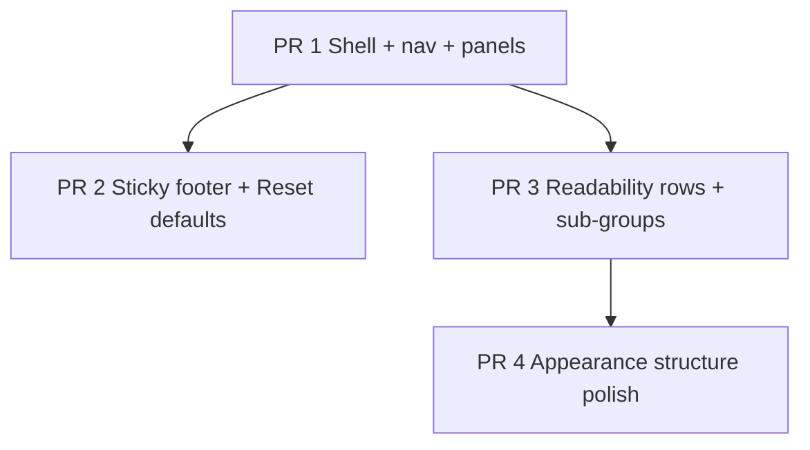

# Settings UX: Category Nav, Readability, and Reset Defaults

| Field | Value |
| --- | --- |
| **Document title** | Settings UX: Category Nav, Readability, and Reset Defaults |
| **Author** | design (Settings UX proposal → implementation plan) |
| **Date** | 2026-08-11 |
| **Status** | Ready for implementation / `/execute-plan` |
| **Baseline branch** | `release/v0.2.1` (current workspace) |
| **Workspace** | `C:\Users\ZeusVeilmon\Desktop\Project\Program\RustyDownloadManager` |

---

## Overview

RusticDL’s Settings view is a single long scroll of GroupBoxes (**General → System → Browser capture → Appearance → Data**) with a primary **Save settings** action at the bottom. Field labels and hints share nearly identical visual weight (`text_xs`), so the page feels flat and hard to scan. Appearance packs many controls into one card. There is no wayfinding beyond section titles, and no global **Reset defaults** (only section-local **Reset appearance**).

This design restructures Settings into a **small app-within-the-app**:

1. **Vertical mini-nav + one category panel at a time** (no full-page scroll of all sections).
2. **Sticky footer** with **Reset defaults** + **Save settings** always visible.
3. **Stronger hierarchy** via toggle/choice rows, sub-group eyebrows, and quieter hints.

Implementation is split into four incremental PRs suitable for `/execute-plan`.

---

## Goals

| Goal | Success signal |
| --- | --- |
| Find any category in one click | No hunting via long scroll |
| Always-available commit/reset | Save + Reset visible without scrolling past content |
| Scannable fields | Labels dominate hints; sub-groups anchor the eye |
| Safe factory reset of prefs | Confirm-gated; preserves window layout + download folder |
| Stay on-brand | Reuse GroupBox, button, sidebar active-state language |

---

## Non-goals (v1)

- Settings search / “Go to setting…” command palette
- Replacing the main download sidebar with settings categories when Settings is open
- Scrollspy on a single infinite form
- Auto-save on Reset (user still presses Save)
- True Switch control if gpui-component has none (Off/On segmented buttons stay acceptable in horizontal rows)
- Dirty dots per nav item, persist last category, keyboard category cycling (stretch / later)
- Version bump / README marketing copy (unless a follow-up release PR wants it)

---

## Current baseline

| Area | Path | Notes |
| --- | --- | --- |
| Settings UI | `src/app/settings_panel.rs` | One `overflow_y_scroll` stack; max width ~720; Save at end |
| Settings model | `src/settings.rs` | `Settings` + `reset_appearance()`; full `Default` |
| Extension prefs | `src/extension_settings.rs` | Nested under `Settings.extension` |
| App root | `src/app/mod.rs` | Draft settings, `save_settings`, `reset_appearance_draft`, input/slider entities |
| Field chrome | `src/app/widgets.rs` | `field_label`, `field_hint` both `text_xs` |
| Confirm UX | `src/app/confirm_dialogs.rs` | Pattern to reuse for reset |
| Main nav | `src/app/sidebar.rs` | `nav_item` active styling — visual reference for mini-nav |

Sections today: **General**, **System**, **Browser capture**, **Appearance**, **Data**.

---

## Target UX structure

```
┌────────────┬───────────────────────────┬────────────────────────────┐
│ Main nav   │ Settings mini-nav         │ Category content (scroll)  │
│ All/…      │ · General                 │                            │
│ Settings ● │ · System                  │  one GroupBox / panel      │
│            │ · Browser                 │  with optional sub-groups  │
│            │ · Appearance              │                            │
│            │ · Data                    │                            │
│            ├───────────────────────────┴────────────────────────────┤
│            │  [ Reset defaults ]                  [ Save settings ] │
└────────────┴────────────────────────────────────────────────────────┘
```

### Shell layout (GPUI)

- Outer settings view: full-size `v_flex`.
- Body: `h_flex` with:
  - **Mini-nav** ~148–168px wide (`ui_density` aware if practical), flex-shrink 0.
  - **Content**: `flex_1`, `overflow_y_scroll`, padded; renders **only** the active category.
- **Footer**: non-scrolling bottom bar (border-top, padded). Do **not** rely on CSS `position: sticky`; use flex shell (scroll region = middle only).

### Category state

```rust
// Conceptual — exact placement left to implementer (settings.rs or app module)
enum SettingsCategory {
    General,
    System,
    Browser,
    Appearance,
    Data,
}
```

- Store `settings_category: SettingsCategory` on `DownloadApp` (or settings-local state owned by the app).
- Default: `General`.
- Switching category **must not** discard the in-memory draft (`self.settings` and bound inputs remain).
- Persist last category: **out of scope v1**.

### Mini-nav visuals

- Icon + short label per category (reuse existing IconName vocabulary where possible: Folder, Settings, Palette, etc.).
- Active: soft fill and/or accent emphasis consistent with `nav_item` / primary outline language.
- Inactive: muted text, hover affordance.
- No badge counts.
- Labels: **General**, **System**, **Browser**, **Appearance**, **Data** (Browser = current “Browser capture” panel).

---

## Information architecture

```
Settings
├── General
│   ├── Downloads — download directory
│   └── Limits — max concurrent, auto-retry, speed limit
├── System
│   ├── Window & startup — close to tray, launch at startup, start minimized
│   ├── Notifications — OS mode, notify complete, notify fail
│   └── Clipboard — clipboard URL watch
├── Browser
│   ├── Capture — enable browser capture
│   ├── Handoff — download handoff mode
│   ├── UI — context menu, toolbar badge, progress after handoff
│   ├── Filters — excluded hosts, captured extensions
│   └── Diagnostics — capture debug logging
├── Appearance
│   ├── Theme & color — theme, accent (+ custom HSL), preview
│   ├── Glass & texture — transparency, backdrop blur, noise, vignette
│   ├── Layout & motion — UI density, corner radius, reduce motion
│   ├── Progress — progress style
│   └── [Reset appearance] (section-local, existing)
└── Data
    └── App data directory — path, copy, open
```

Footer (all categories): **Reset defaults** | **Save settings**

---

## Reset defaults semantics

### Behavior

1. User clicks **Reset defaults**.
2. Confirm dialog (required), suggested copy:

   > **Reset settings to defaults?**  
   > Theme, download limits, notifications, system options, and browser capture will return to recommended defaults.  
   > Window size and download folder are kept.  
   > You still need to press **Save settings** to persist.

3. On confirm: apply **draft** reset (do not write disk yet).
4. Rebind all settings-bound `InputState` / slider entities to the new draft values (same pattern as `reset_appearance_draft`).
5. Call `apply_appearance` so live theme preview updates.
6. User presses **Save settings** to persist (existing path: validate, write `settings.json`, sync engine/IPC/extension as today).

### Preserve vs reset

| Preserve | Reset to `Settings::default()` / nested defaults |
| --- | --- |
| `window_layout` | Theme, accent, noise, transparency, blur, density, radius, motion, vignette, progress style |
| `download_directory` (current user path) | `max_concurrent_downloads`, `auto_retry_attempts`, `speed_limit_kib_per_second` |
| | `close_to_tray`, `launch_at_startup`, `startup_minimized` |
| | `os_notify_mode`, `notify_on_complete`, `notify_on_fail`, `clipboard_watch_enabled` |
| | `extension` → `ExtensionIntegrationSettings::default()` |
| | `sort_column` / `sort_direction` (queue sort prefs are settings; include in full reset) |

### API sketch

```rust
impl Settings {
    /// Factory prefs for everything except window geometry and download folder.
    pub fn reset_to_defaults_preserving_layout_and_dir(&mut self) {
        let keep_dir = self.download_directory.clone();
        let keep_layout = self.window_layout.clone();
        *self = Settings::default();
        self.download_directory = keep_dir;
        self.window_layout = keep_layout;
        self.sanitize_appearance();
    }
}
```

Name may vary; behavior must match the table.

### Relationship to **Reset appearance**

- Keep **Reset appearance** inside the Appearance panel (section-local, no confirm required unless product later wants one).
- Global reset is broader and confirm-gated.
- Both remain draft-only until Save.

### Unit tests (PR 2)

- After reset helper: appearance/system/extension match defaults; `download_directory` and `window_layout` unchanged.
- Round-trip: mutate, reset, assert preserve fields.

---

## Readability system

### Type scale

| Role | Spec |
| --- | --- |
| Page title | Keep `text_lg` bold “Settings” |
| Category panel title | `text_sm`/`text_base` semibold + icon (GroupBox title) |
| Sub-group eyebrow | `text_xs`, muted, uppercase or small-caps tracking (e.g. `NOTIFICATIONS`) |
| Field label | Prefer **`text_sm` medium/semibold** foreground (stronger than today) |
| Hint | `text_xs` muted ~0.78 opacity; **use sparingly** |

### Row patterns

**1. Toggle / choice row** (System, Browser binaries, short enums):

```
Label text                                    [ Off | On ]
optional one-line hint under label only when non-obvious
```

- Label (+ optional hint) left; control cluster right, vertically centered.
- Prefer this over “label → full-width Off/On stack → long paragraph” for every boolean.

**2. Form stack** (paths, multi-inputs, sliders, accent mixer):

```
Label
[ wide control … ]
hint if needed
```

### Hint policy

| Keep under control | Drop or demote |
| --- | --- |
| `0` = unlimited speed | Repeated “Saved with Save settings” on every field |
| Host/extension list format | Obvious Off/On restatements |
| Acrylic/transparency interaction (once per glass group) | Duplicate notify blurbs if section intro covers it |

Section-level note once (e.g. under Browser panel intro or footer): saves apply via **Save settings**; extension syncs when connected.

### Helpers (suggested locations)

In `src/app/widgets.rs` (names flexible):

- `settings_field_label` — stronger label (or upgrade existing `field_label` carefully if all call sites want it)
- `settings_subgroup(title)` — eyebrow + optional top divider
- `settings_toggle_row` / layout helper that places label column + control column

Do not break non-settings call sites of `field_label`/`field_hint` in add dialog without checking.

---

## Sticky footer

| Control | Placement | Style | Action |
| --- | --- | --- | --- |
| **Reset defaults** | Left | Outline / ghost | Open confirm → draft reset |
| **Save settings** | Right | Primary + check icon (existing) | Existing `save_settings` |

Optional (not required v1): quiet “Unsaved changes” between buttons when draft ≠ last saved snapshot. Skip if costly.

Remove the lone Save button from the bottom of the old infinite scroll once the footer owns Save.

---

## Key Decisions

1. **Category panels over scrollspy** — One category visible at a time; vertical mini-nav. Rationale: reduces overwhelm, avoids fragile scroll-to-id in GPUI, matches VS Code/Discord prefs patterns.
2. **Flex sticky footer, not CSS sticky** — Scroll only the content pane. Rationale: reliable in GPUI layout.
3. **Reset preserves window layout + download directory** — Full factory prefs without destroying path/geometry. Rationale: least surprising destructive action.
4. **Reset is draft-only; Save persists** — Matches existing appearance draft model and avoids dual write paths. Rationale: consistency and undo via not saving / reopening (loaded file still on disk until Save).
5. **Confirm on global reset only** — Section **Reset appearance** stays one-click. Rationale: global is broad; appearance is already scoped.
6. **Horizontal boolean rows + rarer hints** — Hierarchy over more chrome. Rationale: screenshots show wall-of-text density.
7. **Keep main sidebar as download filters** — Settings mini-nav is internal to the settings view. Rationale: avoids “where did my queues go?” when opening Settings.
8. **Four PRs, shared file awareness** — Structure → Reset/footer → Readability → Appearance polish. Rationale: reviewable slices; stack linearization 1→2→3→4 reduces `settings_panel.rs` thrash.

---

## Open Questions

None. All product choices were locked from the approved proposal:

- Nav: R1 vertical mini-nav + panels  
- Reset: preserve layout + download dir; draft + Save; confirm  
- Keep section Reset appearance  
- Boolean rows with existing Off/On buttons  
- No search / dirty dots / category keyboard in v1  

---

## Implementation risks

| Risk | Mitigation |
| --- | --- |
| Stale inputs after reset | Rebind every settings-bound Input/slider like `reset_appearance_draft` |
| Category switch loses draft | Draft lives on `self.settings`; only UI selection changes |
| Footer not “sticky” | Flex shell; content scrolls, footer outside scroll |
| Extension prefs half-reset | Assign full `ExtensionIntegrationSettings::default()` |
| Parallel PRs conflict on `settings_panel.rs` | Prefer stack order PR1→2→3→4; recommend `--concurrency 1` for execute-plan |
| Upgrading global `field_label` breaks add dialog density | Prefer settings-specific helpers or scoped style changes |

---

## QA checklist (manual)

- [ ] Open Settings: mini-nav shows five categories; General selected.
- [ ] Switch categories: only one panel; draft values survive switches.
- [ ] Footer always visible; Save still validates and persists.
- [ ] Reset defaults → cancel leaves state unchanged.
- [ ] Reset defaults → confirm resets theme/limits/notifications/extension UI; download path + window geometry unchanged in draft.
- [ ] After reset, Save writes disk; restart shows saved values.
- [ ] Reset appearance still works in Appearance and does not clear download limits.
- [ ] System/Browser booleans are scannable as rows; no repeated “Saved with…” spam.
- [ ] Appearance sub-groups readable; preview near theme/accent; glass controls grouped.
- [ ] Compact density: mini-nav and footer still usable.
- [ ] Light + dark themes: contrast on labels, nav active state, footer border.

---

## PR Plan

Incremental, independently reviewable PRs. Linearized stack for Graphite/plain-git: **PR 1 → PR 2 → PR 3 → PR 4**.

### PR 1: Settings category shell with vertical mini-nav and panel routing

- **Description:** Introduce `SettingsCategory` (`General`, `System`, `Browser`, `Appearance`, `Data`) and `settings_category` state on `DownloadApp`. Refactor `render_settings` into a shell: thin vertical mini-nav (icon + label, active state consistent with existing nav language) + content area that renders **one** category panel at a time. Split existing GroupBox bodies into per-category render helpers without changing field behavior or save semantics. Remove the single long scroll that stacks all sections. Default category: General. Save may remain temporarily at the bottom of content until PR 2 moves it to the sticky footer. No global reset yet.
- **Files/components affected:** `src/app/settings_panel.rs`, `src/app/mod.rs`, optionally `src/app/widgets.rs` (compact settings-nav row helper)
- **Dependencies:** None

### PR 2: Sticky footer with Save settings and Reset defaults

- **Description:** Add a non-scrolling sticky footer in the settings shell: left **Reset defaults** (outline/ghost), right **Save settings** (primary + check, existing `save_settings` handler). Implement `Settings::reset_to_defaults_preserving_layout_and_dir` (name flexible) that restores defaults for all prefs **except** `window_layout` and `download_directory`. Wire `DownloadApp::reset_settings_draft` to rebind inputs/sliders and call `apply_appearance`, mirroring `reset_appearance_draft`. Confirm dialog before applying draft reset (reuse `confirm_dialogs`); copy states what is reset vs kept and that Save is still required to persist. Keep Appearance **Reset appearance**. Unit tests for preserve/reset fields. Remove duplicate standalone Save from content once footer owns it.
- **Files/components affected:** `src/settings.rs`, `src/app/mod.rs`, `src/app/settings_panel.rs`, `src/app/confirm_dialogs.rs`
- **Dependencies:** PR 1

### PR 3: Settings readability with row patterns, sub-groups, and hint cull

- **Description:** Add reusable settings layout helpers in `widgets.rs` (stronger field label, toggle/choice row layout, sub-group eyebrow). Raise label hierarchy relative to hints. Convert System and Browser boolean stacks to horizontal rows (label left, Off/On or choice cluster right). Add muted sub-group eyebrows + dividers per IA (Downloads/Limits; Window & startup/Notifications/Clipboard; Capture/Handoff/UI/Filters/Diagnostics). Cull redundant hints; drop repeated per-field “Saved with Save settings”; keep hints only for non-obvious behavior. Apply across General, System, Browser, and Data panels (Appearance structure deferred to PR 4 except shared helpers).
- **Files/components affected:** `src/app/widgets.rs`, `src/app/settings_panel.rs`
- **Dependencies:** PR 1

### PR 4: Appearance panel sub-groups and polish

- **Description:** Within the Appearance category only, organize controls into sub-groups: Theme & color; Glass & texture; Layout & motion; Progress. Place Preview near theme/accent. Group transparency, backdrop blur, noise, and vignette under Glass & texture. Preserve live draft preview behavior and section **Reset appearance**. Align hint density with PR 3 policy. Manual visual QA on dark/light themes.
- **Files/components affected:** `src/app/settings_panel.rs`, optionally `src/app/widgets.rs` (preview strip helper if extracted)
- **Dependencies:** PR 1, PR 3



**Linearized stack order:** PR 1 → PR 2 → PR 3 → PR 4  

(PR 2 and PR 3 are independent after PR 1; numeric linearization yields 1→2→3→4, which serializes edits to `settings_panel.rs` and is preferred for stack assembly.)

**Execute-plan recommendation:**  

```text
/execute-plan docs/plans/settings-ux-nav-reset.md --concurrency 1
```

Use `--concurrency 1` to avoid parallel implementers thrashing the same UI file. Add `--no-graphite` / `--auto-pr` as environment requires.

---

## References

| Resource | Path |
| --- | --- |
| Settings panel | `src/app/settings_panel.rs` |
| Settings model | `src/settings.rs` (`reset_appearance`, `Default`) |
| App draft/save | `src/app/mod.rs` (`save_settings`, `reset_appearance_draft`) |
| Field helpers | `src/app/widgets.rs` (`field_label`, `field_hint`) |
| Confirm dialogs | `src/app/confirm_dialogs.rs` |
| Main sidebar nav | `src/app/sidebar.rs` |
| Extension settings | `src/extension_settings.rs` |
| Near-term product plan (context) | `docs/plans/near-term-v0.2-foundation.md` |
